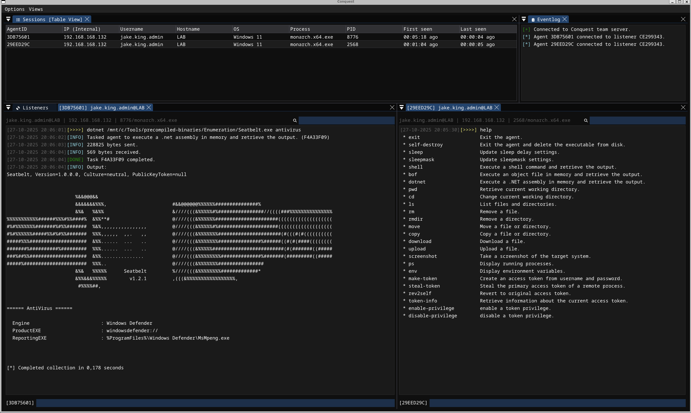
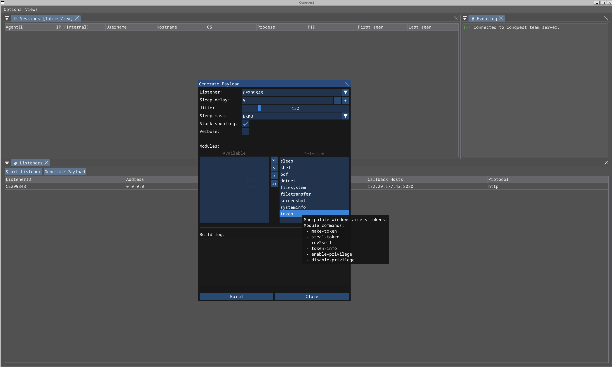
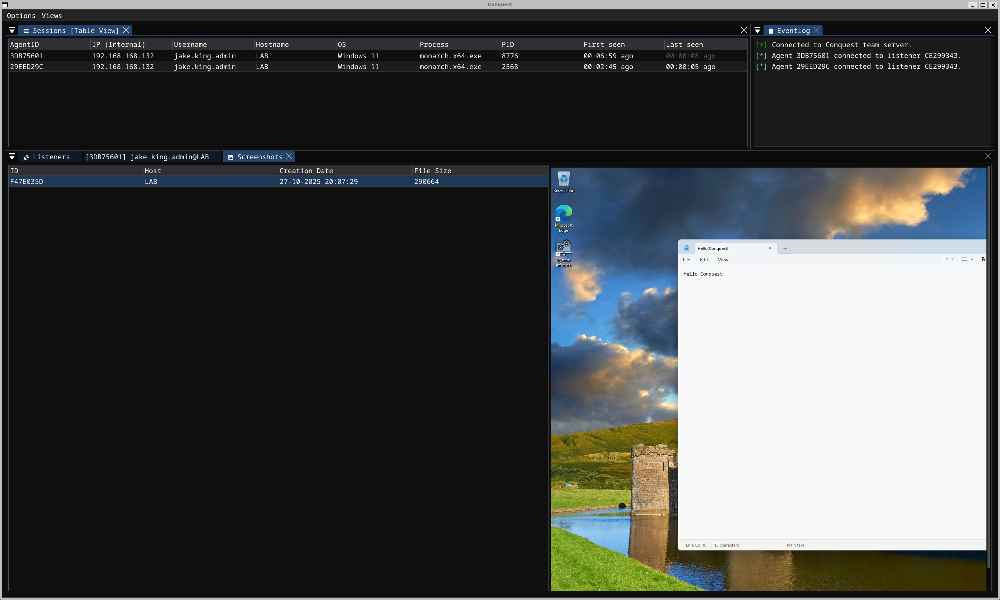

# Conquest 

Conquest is an advanced, extensible and malleable command & control/post-exploitation framework developed for penetration testing and adversary simulation. Conquest's team server, operator client and agent have all been written using the Nim programming language and are designed with modularity and flexibility in mind. It features custom C2 communication via binary packets over HTTP, a client GUI developed using Dear ImGui and the `Monarch` agent, a modular C2 implant aimed at Windows targets.



> [!CAUTION]
> Conquest is designed to be only used for educational purposes, research and authorized security testing of systems that you own or have an explicit permission to attack. The author provides no warranty and accepts no liability for misuse.

## Getting Started

1. Install Nim

2. Build the Conquest team server and client

```
nimble server
nimble client
```

3. Start the team server with a C2 profile
```
bin/server -p data/profile.toml
```

4. Connect to the team server using the client (localhost by default)
```
bin/client
```

## Architecture

TBD

## Features

- Flexible operator GUI client written with Dear ImGui in Nim
- HTTP listeners with support for callback hosts (Redirectors)
- Support for malleable C2 profiles (TOML)
- Customizable payload generation  
- Encrypted C2 communication leveraging AES256-GCM and X25519 key exchange
- Sleep obfuscation via Ekko, Zilean or Foliage with support for call stack spoofing
- Inline-execution of COFF/BOF files
- Inline-execution of .NET assemblies
- Token impersonation 
- AMSI/ETW patch using hardware breakpoints
- Compile-time string obfuscation 
- Wide selection of built-in post-exploitation modules
- Looting and loot management
- Logging of all operator activity
- Self-deletion 

## Screenshots



