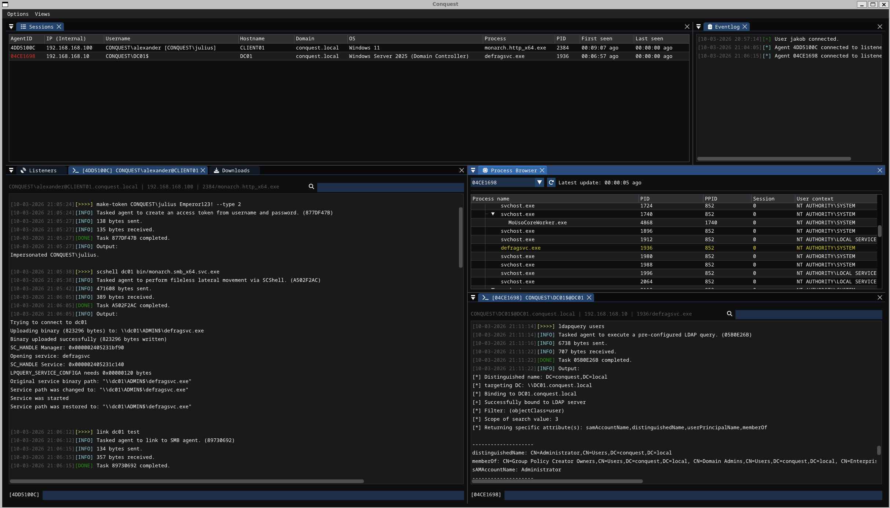

 

**Conquest** is a feature-rich, extensible and malleable command & control/post-exploitation framework developed for penetration testing and adversary simulation. Conquest's team server, operator client and agent have all been developed from scratch using the Nim programming language and are designed with modularity and flexibility in mind. It features custom C2 communication via binary packets over HTTP, a client GUI developed using Dear ImGui and the `Monarch` agent, a modular C2 implant aimed at Windows targets.

> [!CAUTION]
> Conquest is designed to be only used for educational purposes, research and authorized security testing of systems that you own or have an explicit permission to attack. The author provides no warranty and accepts no liability for misuse.

## Getting Started

The Conquest team server and operator client are currently meant to be compiled and used on a Ubuntu/Debian-based operating system. For getting the framework up and running, follow the [installation instructions](./docs/1-INSTALLATION.md). 

For more information about architecture, usage and features, check out the [documentation](./docs/README.md)!

## Features

- Flexible operator GUI client developed using Dear ImGui
- HTTP listeners with support for callback hosts (Redirectors)
- Support for malleable C2 profiles (TOML)
- Customizable payload generation  
- Encrypted C2 communication leveraging AES256-GCM and X25519 key exchange
- Sleep obfuscation via Ekko, Zilean or Foliage with support for call stack spoofing
- In-memory execution of COFF/BOF files
- In-memory execution of .NET assemblies
- Token impersonation 
- AMSI/ETW patching using hardware breakpoints
- Compile-time string obfuscation 
- Wide selection of built-in post-exploitation modules
- Looting and loot management (downloads & screenshots)
- Logging of all operator activity
- Self-destruct functionality
- Agent kill date & working hours
- Fully written in Nim

## Screenshots

## Acknowledgements

The following projects and people have significantly inspired and/or helped with the development of this framework.

- Inspiration:
  - [Havoc](https://github.com/havocFramework/havoc) by [C5pider](https://github.com/Cracked5pider)
  - [Cobalt Strike](https://www.cobaltstrike.com)
  - [AdaptixC2](https://github.com/Adaptix-Framework/AdaptixC2/)
- Development:
  - [imguin](https://github.com/dinau/imguin) by [dinau](https://github.com/dinau/) (ImGui Wrapper for Nim)
  - [MalDev Academy](https://maldevacademy.com/)
  - [Creds](https://github.com/S3cur3Th1sSh1t/Creds) by [S3cur3Th1sSh1t](https://github.com/S3cur3Th1sSh1t/)
  - [malware](https://github.com/m4ul3r/malware/) by [m4ul3r](https://github.com/m4ul3r/)
  - [winim](https://github.com/khchen/winim) 
  - [OffensinveNim](https://github.com/byt3bl33d3r/OffensiveNim)
- Existing C2's written (partially) in Nim
  - [NimPlant](https://github.com/chvancooten/NimPlant)
  - [Nimhawk](https://github.com/hdbreaker/Nimhawk)
  - [grc2](https://github.com/andreiverse/grc2)