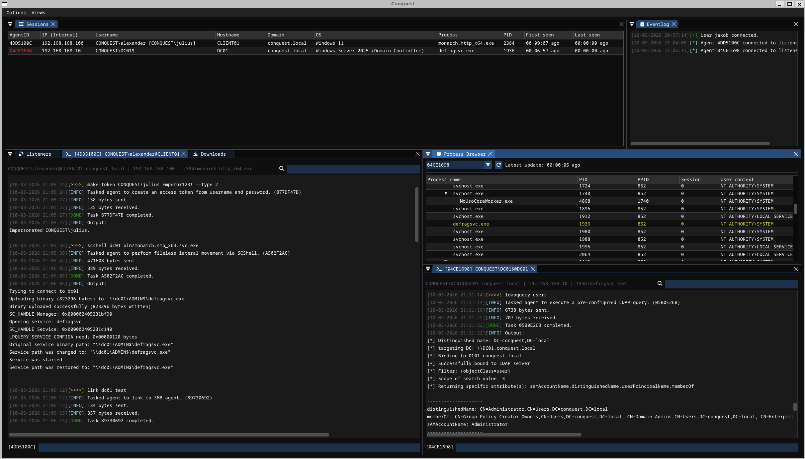
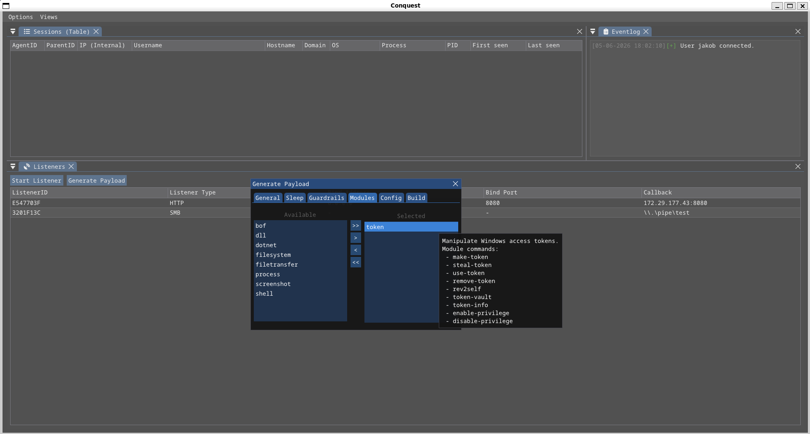
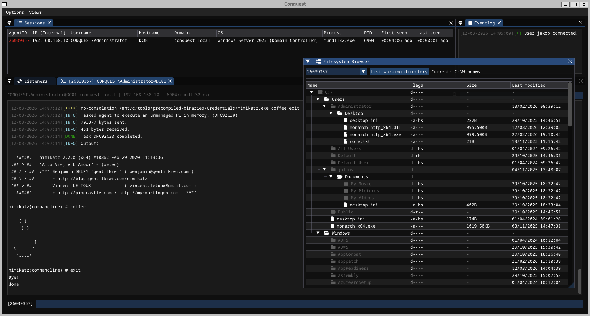
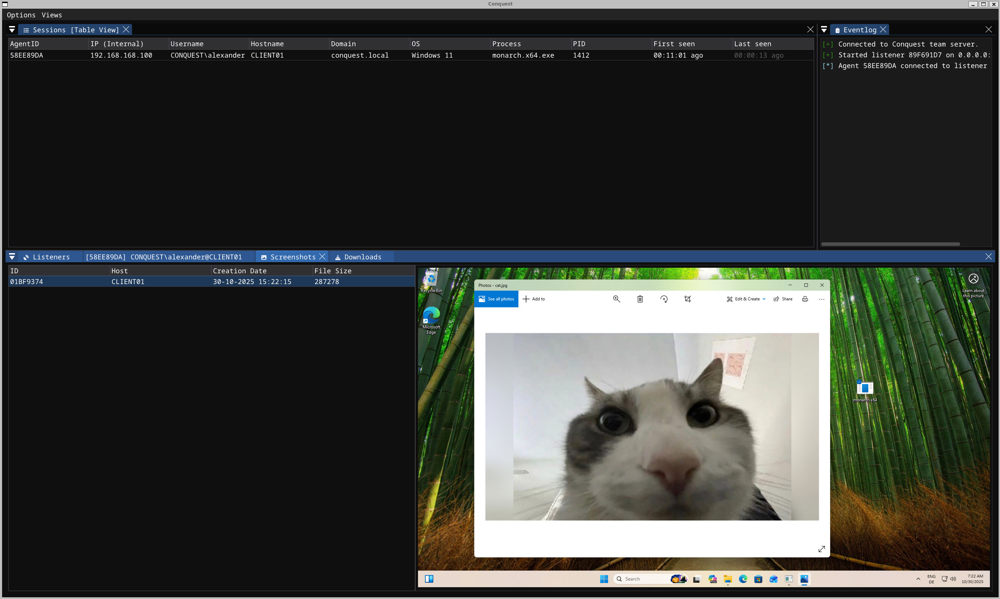

 

**Conquest** is a feature-rich, extensible and malleable command & control/post-exploitation framework developed for penetration testing and adversary simulation. Conquest's team server, operator client and agent have all been developed using the Nim programming language and are designed with modularity and flexibility in mind. It features an advanced malleable profile system for customizing network traffic, a multi-user client GUI developed using Dear ImGui and the `Monarch` agent, an extensible C2 implant aimed at Windows targets.

> [!CAUTION]
> Conquest is designed to be only used for educational purposes, research and authorized security testing of systems that you own or have an explicit permission to attack. The author provides no warranty and accepts no liability for misuse.

## Getting Started

The Conquest team server and operator client are currently meant to be compiled and used on a Ubuntu/Debian-based operating system. For getting the framework up and running, follow the [installation instructions](./docs/1-INSTALLATION.md). 

For more information about architecture, usage and features, check out the [documentation](./docs/README.md)!

## Features

### Conquest Team Server
  
- Different listener types: HTTP, SMB
- Advanced malleable C2 profile system for configuring network traffic (TOML v1.1)
- Encrypted C2 communication leveraging AES256-GCM and X25519 key exchange
- Logging of all operator activity
- Loot management for downloads and screenshots

### Operator Client

- Websocket-based GUI developed using Dear ImGui
- Multi-client support and password-based user authentication
- Flexible payload generation with module selection
- File and process browser components
- Console history and auto-complete for agent commands
- Extensible Python Scripting API for creating commands and modules
- Battle-tested [module ecosystem](https://github.com/jakobfriedl/conquest-modules) 

### Monarch Agent

- Different payload types: .exe, .dll, .svc.exe
- Sleep obfuscation via Ekko, Zilean or Foliage with support for call stack spoofing
- Stable COFF/BOF Loader
- In-memory execution of .NET assemblies
- Token manipulation 
- AMSI/ETW patching via hardware breakpoints
- Compile-time string obfuscation 
- Self-destruct functionality
- Agent kill date & working hours

## Screenshots

## Acknowledgements

The following projects and people have significantly inspired and/or helped with the development of this framework.

- Inspiration:
  - [Havoc](https://github.com/havocFramework/havoc) by [C5pider](https://github.com/Cracked5pider)
  - [Cobalt Strike](https://www.cobaltstrike.com)
  - [AdaptixC2](https://github.com/Adaptix-Framework/AdaptixC2/)
- Development:
  - [imguin](https://github.com/dinau/imguin) by [dinau](https://github.com/dinau/) (ImGui Wrapper for Nim)
  - [MalDev Academy](https://maldevacademy.com/)
  - [Creds](https://github.com/S3cur3Th1sSh1t/Creds) by [S3cur3Th1sSh1t](https://github.com/S3cur3Th1sSh1t/)
  - [malware](https://github.com/m4ul3r/malware/) by [m4ul3r](https://github.com/m4ul3r/)
  - [winim](https://github.com/khchen/winim) 
  - [OffensiveNim](https://github.com/byt3bl33d3r/OffensiveNim)
- Existing C2's written (partially) in Nim
  - [NimPlant](https://github.com/chvancooten/NimPlant)
  - [Nimhawk](https://github.com/hdbreaker/Nimhawk)
  - [grc2](https://github.com/andreiverse/grc2)
  - [Nimbo-C2](https://github.com/itaymigdal/Nimbo-C2)