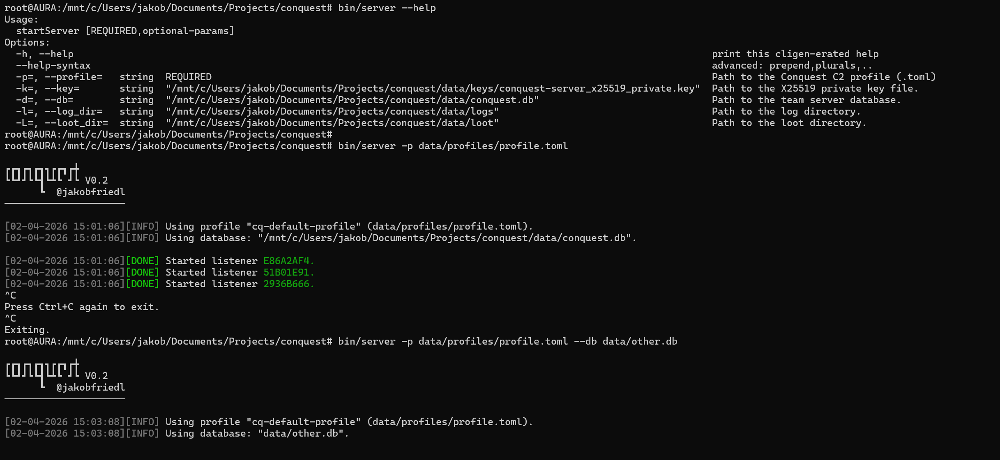

# Installation

## 1. Clone the Conquest repository
```
git clone https://github.com/jakobfriedl/conquest
cd conquest
```

## 2. Install Nim.

```bash
curl https://nim-lang.org/choosenim/init.sh -sSf | sh
```

After it is installed, the Nim binaries need to be added to the PATH.

```
export PATH=/home/kali/.nimble/bin:$PATH
```

## 3. Install dependencies

The Conquest binaries for team server and client are designed to be compiled and run on Ubuntu/Debian-based systems. The operator client requires the subsequent dependencies to be installed. To run the client on a Windows host, install the same dependencies in WSL.

```
sudo apt update
sudo apt install gcc g++ make git curl xz-utils
sudo apt install libglfw3-dev libgl1-mesa-dev libglu1-mesa-dev libx11-dev libxrandr-dev libxinerama-dev libxcursor-dev libxi-dev libgtk2.0-0
```

## 4. Compile Conquest binaries 

The Conquest binaries are compiled using the `nimble` command, which installs and updates all Nim libraries and dependencies automatically.

```
nimble server
nimble client
```

Optionally, the required dependencies can be installed manually using the following command prior to the compilation.

```
nimble install -d
```

## 5. Start the Conquest team server with a C2 profile. 

The default profile is located in [data/profile.toml](../data/profile.toml) and can be adapted by the operator.
```
sudo bin/server -p data/profile
```

On the first start, the Conquest team server creates the Conquest database in the data directory, as well as the team server's private key in data/keys, which is used for the key exchange between team server, client and agent. 



## 6. Start the Conquest operator client

```
bin/client
```

By default, the Conquest client connects to localhost:37573 to connect to the team server. In order to connect to a remote team server, the address and port can be specified from the command-line using the `-i` and `-p` flags. The team server port can be configured in the malleable C2 profile used by the server.

```
bin/client -i <team-server-address> -p <team-server-port>
```