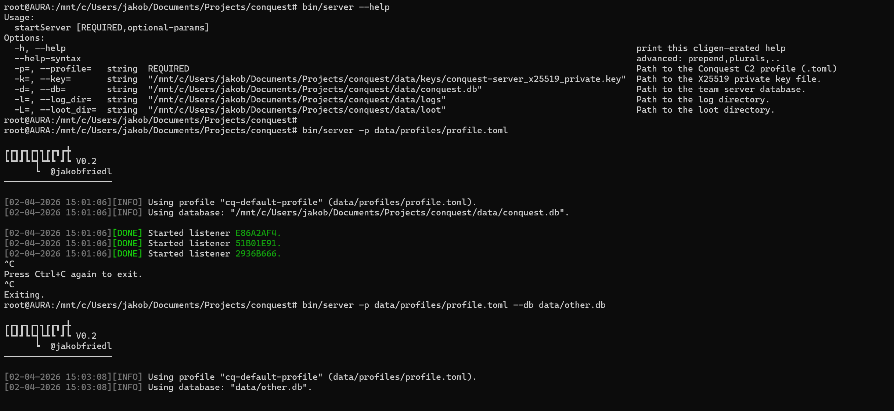

# Manual Installation

## 1. Clone the Repository
Use `--recurse-submodules` to also clone the conquest-modules repository.
```bash
git clone https://github.com/jakobfriedl/conquest --recurse-submodules
cd conquest
```

## 2. Install Nim
Conquest requires Nim 2.2.6. Install it via choosenim:
```bash
curl https://nim-lang.org/choosenim/init.sh -sSf | sh
```
Then add the Nim binaries to your PATH in `.bashrc`, `.zshrc`, or `.profile`:
```bash
export PATH=/home/<user>/.nimble/bin:$PATH
```

## 3. Install Dependencies
Conquest is designed to be compiled and run on Ubuntu/Debian-based systems. To run the operator client on Windows, install these dependencies in WSL instead.
```bash
sudo apt update
sudo apt install gcc g++ make git curl xz-utils
sudo apt install libglfw3-dev libgl1-mesa-dev libglu1-mesa-dev libx11-dev libxrandr-dev libxinerama-dev libxcursor-dev libxi-dev libgtk2.0-dev
```

## 4. Compile

```bash
nimble server
nimble client
```

To install the framework files to a custom location (e.g. `/usr/share/conquest`), set `CONQUEST_ROOT` before building:

```bash
CONQUEST_ROOT="/usr/share/conquest" nimble server
CONQUEST_ROOT="/usr/share/conquest" nimble client
```

## 5. Start the Team Server
The default C2 profile is located at `data/profiles/profile.toml`.
```bash
bin/server -p data/profiles/profile.toml
```
On first start, Conquest initializes the database and generates the team server keypair in `data/keys/`, used for key exchange between server, client, and agent.

The server accepts the following flags:

| Flag | Short | Default | Description |
| --- | --- | --- | --- |
| `--profile` | `-p` | *(required)* | Path to the Conquest C2 profile (`.toml`) |
| `--key` | `-k` | `data/keys/conquest-server_x25519_private.key` | Path to the X25519 private key file |
| `--db` | `-d` | `data/conquest.db` | Path to the team server SQLite database |
| `--log-dir` | `-l` | `data/logs` | Directory for team server and session logs |
| `--loot-dir` | `-L` | `data/loot` | Directory for downloaded files and screenshots |

Default values are relative to the `CONQUEST_ROOT` directory but can be overwritten to point to any file on the system.  



## 6. Start the Operator Client
```bash
bin/client
```
By default, the client connects to `localhost:37573`. To connect to a remote team server, specify the address and port via flags:
```bash
bin/client -i <team-server-address> -p <team-server-port>
```
The team server port is configured in the malleable C2 profile.

---

# AUR
Conquest is available on the [AUR](https://aur.archlinux.org/packages/conquest-git) for Arch-based distributions.
```bash
# paru
paru -S conquest-git

# yay
yay -S conquest-git
```

This will automatically resolve all dependencies, build both the server and client binaries from source, and install them to `/usr/share/conquest/`. A symlink to the client binary is created at `/usr/local/bin/conquest`. A systemd service unit is included for running the server as a background service. The default profile is installed to `/etc/conquest/default.toml.

### Dependencies
The following packages will be pulled in automatically:
`nim`, `nimble`, `git`, `curl`, `base-devel`, `xz`, `glfw-x11`, `mesa`, `glu`, `libx11`, `libxrandr`, `libxinerama`, `libxcursor`, `libxi`, `gtk2`