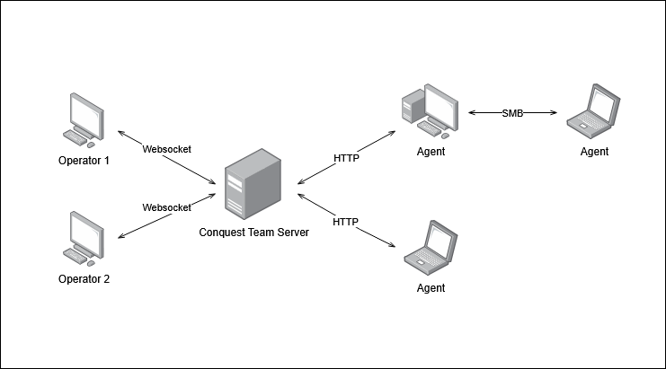
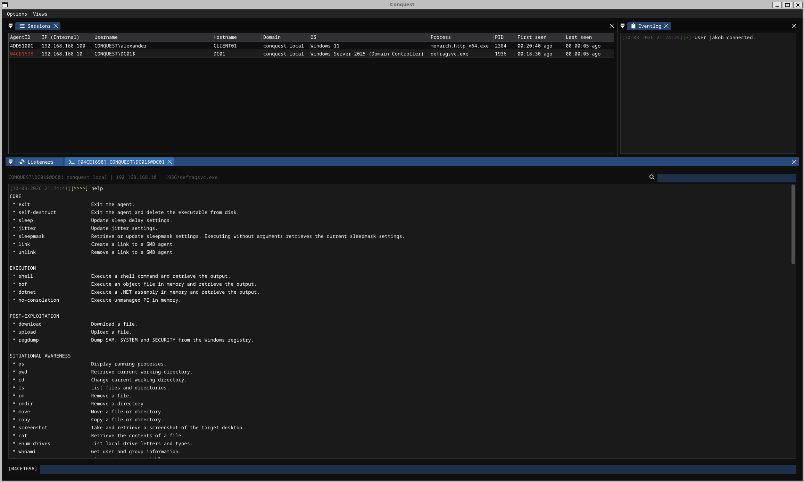
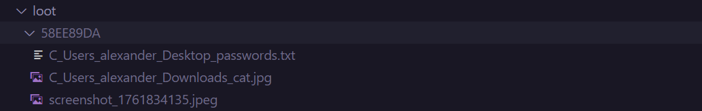

# Architecture <!-- omit from toc -->

## Contents <!-- omit from toc -->
- [Components](#components)
  - [Team Server](#team-server)
  - [Operator Client](#operator-client)
  - [Agent (Monarch)](#agent-monarch)
- [Communication Protocol](#communication-protocol)
  - [Registration](#registration)
  - [Heartbeat](#heartbeat)
  - [Task](#task)
  - [Result](#result)
- [Cryptography](#cryptography)
- [Directory Structure](#directory-structure)
  - [Logging](#logging)
  - [Looting](#looting)


## Components

The Conquest command & control framework consist of three major components that interact with each other in different ways. Together, they enable penetration tester and red teamers to remotely control systems, transfer files and more. The diagram below shows Conquests's overall architecture.



### Team Server

The Conquest team server is the core of the framework, as it's main responsibility is serving the HTTP listeners with which the C2 agents communicate and queuing the tasks that are issued by the operator client. The team server further manages data about agents, listeners and loot in the Conquest database and records all agent and operator activity in log files. The team server exposes a WebSocket interface on port 37573 by default, which is used by the operator client to connect to the team server. This port can be changed in the C2 profile in the `[team-server]` section.

```toml
[team-server]
port = 37573
```

Starting the team server with the default profile is done with the following command.

```
bin/server -p data/profile.toml
```

### Operator Client

The Conquest client is used by the operator to conduct the engagement. It is used for starting and stopping listeners, generating `Monarch` payloads and interacting with active agent sessions. The agent console is used to send commands to the agent and display the output. Currently, only one client can connect to the Conquest team server. By default, the client connects to localhost:37573, but the address and port can be specified in the command-line as shown below.

```
bin/client -i <team-server-ip> -p <team-server-port>
```



More information about the user interface can be found [here](./4-CLIENT.md)

### Agent (Monarch)

The agent/implant/payload/beacon in Conquest is called `Monarch`. It is exclusively built to target Windows systems and can be equipped with different modules or commands during the generation. An agent is compiled to connect to a specific listener and has it's configuration embedded during the generation process. When it connects back to the team server, it can be tasked to execute the commands that have been built into it. As most other C2 agents, the `Monarch` uses beaconing to check-in with the team server periodically to poll for new tasks or to post the results of completed tasks. This is done over HTTP using a custom binary communication protocol, which is explained in more detail in subsequent sections. 

## Communication Protocol

Conquest’s C2 communication occurs over HTTP and uses 4 distinct types of packets:

- **Registration**: The first message that a new agent sends to the team server to register itself to it. Contains metadata to identify the agent and the system it is running on, such as the IP-address, hostname and current username.
- **Heartbeat**: Small check-in requests that tell the team server that the agent is still alive and waiting for tasks.
- **Task**: When an operator interacts with an agents and executes a command, a task packet is dispatched that contains the command to be executed and all arguments.
- **Result**: After an agent completes a task, it sends a packet containing the command output to the team server, which displays the result to the operator.

Each packet consists of a fixed-size header and a variable-length body, with the header containing important unencrypted metadata that helps the recipient process the rest of the packet. Among other fields, it contains the 4-byte hex-identifier of the agent, which tells the team server which agent is polling for tasks or posting results. The variable-length payload body is encrypted using AES-256 GCM using a asymmetrically shared session key and a randomly generated initialization vector (IV), which is included in the header for every message. The GCM mode of operation creates the 16-byte Galois Message Authentication Code (GMAC), which is used to verify that the message has not been tampered with. The cryptographic implementations are more thoroughly explained in the [Cryptography](#cryptography) section.

```
   0               1               2               3               4
   ├───────────────┴───────────────┴───────────────┴───────────────┤
4  │                          Magic Value                          │
   ├───────────────┬───────────────┬───────────────────────────────┤
8  │    Version    │  Packet Type  │         Packet Flags          │
   ├───────────────┴───────────────┴───────────────────────────────┤
12 │                         Payload Size                          │
   ├───────────────────────────────────────────────────────────────┤
16 │                           Agent ID                            │
   ├───────────────────────────────────────────────────────────────┤
20 │                       Sequence Number                         │
   ├───────────────────────────────────────────────────────────────┤
24 │                                                               │
28 │                        IV (12 bytes)                          │
32 │                                                               │
   ├───────────────────────────────────────────────────────────────┤
36 │                                                               │
40 │                   GMAC Authentication Tag                     │
44 │                          (16 bytes)                           │
48 │                                                               │
   └───────────────────────────────────────────────────────────────┘
                               [Header]
```

Here is the Nim type for the Header:
```nim
type Header* = object
        magic*: uint32              # [4 bytes ] magic value 
        version*: uint8             # [1 byte  ] protocol version
        packetType*: uint8          # [1 byte  ] message type 
        flags*: uint16              # [2 bytes ] message flags
        size*: uint32               # [4 bytes ] size of the payload body
        agentId*: Uuid              # [4 bytes ] agent id, used as AAD for encryption
        seqNr*: uint32              # [4 bytes ] sequence number, used as AAD for encryption
        iv*: Iv                     # [12 bytes] random IV for AES256 GCM encryption
        gmac*: AuthenticationTag    # [16 bytes] authentication tag for AES256 GCM encryption
```

### Registration 

The **Registration** packet is the first packet that is sent from the agent to the team server. The `packetType` field in the header is set to `MSG_REGISTER`, which tells the team server to handle the request as a new connection. The `agentId` field in the header is set to a randomly generated 4-byte Hex-UUID, which is used to uniquely identify the agent all further communication. The packet body includes important metadata about the system the agent is executed on, such as username, domain and IP address. Furthermore, it also contains the agent's public key, which is used by the team server to derive the session key, with which the communication between them. Variable length data is handled using a TLV (type-length-value) approach. For instance, strings are prefixed with a 4-byte length indicator, instructing the unpacker how many bytes need to be read to retrieve the value.

```nim
type 
    AgentMetadata* = object 
        listenerId*: Uuid
        username*: seq[byte]
        hostname*: seq[byte]
        domain*: seq[byte]
        ip*: seq[byte]
        os*: seq[byte]
        process*: seq[byte]
        pid*: uint32
        isElevated*: uint8
        sleep*: uint32
        jitter*: uint32
        modules*: uint32

    Registration* = object
        header*: Header
        agentPublicKey*: Key        # [32 bytes ] Public key of the connecting agent for key exchange
        metadata*: AgentMetadata
```

### Heartbeat

The **Heartbeat** packet is comparable to a simple Check-in request. Between sleep delays, the agent sends this packet to the team server to poll for new tasks. It also serves as a way to tell if an agent is still alive and active, or has become unresponsive.

```nim
type Heartbeat* = object 
        header*: Header            # [48 bytes ] fixed header
        listenerId*: Uuid          # [4 bytes  ] listener id
        timestamp*: uint32         # [4 bytes  ] unix timestamp
```

### Task

When a new **Task** is dispatched and fetched by an agent, a packet with the structure outlined by the Nim code below is created. It contains the ID of the task, listener and command to be executed, as well as a list of arguments that have been passed to the command.

```nim
type
    TaskArg* = object 
        argType*: uint8             # [1 byte  ] argument type
        data*: seq[byte]            # variable length data (for variable data types (STRING, BINARY), the first 4 bytes indicate data length)

    Task* = object 
        header*: Header
        taskId*: Uuid               # [4 bytes ] task id
        listenerId*: Uuid           # [4 bytes ] listener id
        timestamp*: uint32          # [4 bytes ] unix timestamp
        command*: uint16            # [2 bytes ] command id 
        argCount*: uint8            # [1 byte  ] number of arguments
        args*: seq[TaskArg]         # variable length arguments
```

The number of arguments the agent needs to process is indicated by the argument count (argc) field. The first byte of an argument defines the argument’s type, such as INT, STRING or BINARY. While some argument types have fixed sized (boolean = 1 byte, integers = 4 bytes, …), variable-length arguments, such as strings or binary data are further prefixed with a 4-byte data length field that tells the recipient how many bytes they have to read until the next argument is defined. The currently supported argument types, `STRING`, `INT`, `SHORT`, `LONG`, `BOOL` and `BINARY` determine how an argument is processed. For instance, `BINARY` indicates that file path is passed as an argument, which is then read into memory and sent over the network.

### Result

For each task that an agent executes, a result packet is sent to the team server. This packet is structured similarly to the task, with the difference being that it contains the task output instead of the arguments. The Status field indicates whether the task was completed successfully or if an error was encountered during the execution. The Type field informs the team server of the data type of the task output, with the options being `STRING`, `BINARY` or `NO_OUTPUT`. While string data would be displayed in the user interface to the operator, binary data is written directly to a file.

```
   0               2               4               6               8
   ├───────────────┴───────────────┴───────────────┴───────────────┤
0  │                                                               |
   |                       Header (48 bytes)                       |
   |                                                               |
   ├───────────────────────────────┬───────────────────────────────┤
48 │            Task ID            │           Listener ID         │
   ├───────────────────────────────┼───────────────┬────────┬──────┤
56 |           Timestamp           │      CMD      │ Status │ Type │
   ├───────────────────────────────┼───────────────┴────────┴──────┤
64 │            Length             │                               │
   ├───────────────────────────────┘                               │
   │                                                               │
   │                         Result Data                           │
?? │                                                               │
   └───────────────────────────────────────────────────────────────┘
                               [Result]
```

```nim
type TaskResult* = object 
        header*: Header 
        taskId*: Uuid               # [4 bytes ] task id
        listenerId*: Uuid           # [4 bytes ] listener id
        timestamp*: uint32          # [4 bytes ] unix timestamp
        command*: uint16            # [2 bytes ] command id 
        status*: uint8              # [1 byte  ] success flag 
        resultType*: uint8          # [1 byte  ] result data type
        length*: uint32             # [4 bytes ] result length
        data*: seq[byte]            # variable length result
```

## Cryptography

As mentioned before, the payload body of a network packet is serialized and encrypted. With symmetric ciphers like AES, the agent and team server have to agree on the same encryption key to process the data. However, the key exchange is far more difficult than just sending a randomly generated key over the network, as this would allow anyone to intercept and use it to decrypt and read the C2 traffic. The solution to this dilemma is public key cryptography. The server and all agents own a key pair, consisting of a private key that is kept secret and a public key which can be shared with everyone. The shared secret is computed using the X255192 key exchange, which is based on elliptic-curve cryptography. On a high level, it involves the following steps:

- Both parties generate a **32-byte private key**, from which they derive the corresponding public key.
- Both parties calculate a **shared secret** by using their own private key and the other’s public key.
- A 32-byte session key is derived from the shared secret, which is used to encrypt all C2 communication.
- Ephemeral keys, such as the agent’s private key and the shared secret are **wiped from memory** as soon as they are no longer needed to prevent them from being compromised.

The X25519 implementation used in Conquest is exposed by the [Monocypher](https://monocypher.org/) library. The shared secret is not suitable to be used as the encryption key, as it is not cryptographically random. To derive a session key, the secret is hashed using the Blake2B hashing algorithm along with some other information, such as the public keys and a message, to create a secure 32-byte key.

```nim
# Key derivation
proc combineKeys(publicKey, otherPublicKey: Key): Key = 
    # XOR is a commutative operation, that ensures that the order of the public keys does not matter
    for i in 0..<32:
        result[i] = publicKey[i] xor otherPublicKey[i]

proc deriveSessionKey*(keyPair: KeyPair, publicKey: Key): Key =
    var key: Key
    
    # Calculate shared secret (https://monocypher.org/manual/x25519)
    var sharedSecret = keyExchange(keyPair.privateKey, publicKey)

    # Add combined public keys to hash
    let combinedKeys: Key = combineKeys(keyPair.publicKey, publicKey)
    let hashMessage: seq[byte] = "CONQUEST".toBytes() & @combinedKeys 

    # Calculate Blake2b hash and extract the first 32 bytes for the AES key (https://monocypher.org/manual/blake2b)
    let hash = blake2b(hashMessage, sharedSecret)
    copyMem(key[0].addr, hash[0].addr, sizeof(Key))

    # Cleanup 
    wipeKey(sharedSecret)

    return key
```

When a `Monarch` is generated, it has the public key of the team server patched into it's binary. When the agent is executed, it generates its own key pair. Using the newly created private key and the servers’ public key, it subsequently derives the session key used for the packet encryption. At that point, the agent can wipe its own private key from memory, as it is no longer needed. For the server to be able to derive the same session key, the agent includes its public key in the registration packet, as mentioned before. When the server deserializes and parses the registration packet, it uses its own private key and the agent’s public key to derive the same session key and stores it in a database. Following this exchange, all communication between an agent and the server is encrypted using this session key as explained in the following section.

With the key exchange completed, what follows is the encryption of a network packet’s body using the AES-256 block cipher in the Galois/Counter Mode (GCM) mode of operation. GCM provides authenticated encryption with associated data (AEAD), ensuring that both confidentiality and integrity are guaranteed. This is achieved by combining the Counter Mode (CTR) for encryption and GHASH for authentication. In addition to encrypting the data, an authentication tag, also known as Galois Message Authentication Code (GMAC) is calculated based on the encrypted data and additional authenticated data (AAD). AAD is any unencrypted data, for which integrity and authenticity should be ensured, such as the sequence number that prevents packet replay attacks. If the ciphertext or sequence number of a packet are modified before it is received, the recipient’s recalculation of the 16-byte GMAC will not match the tag included in the packet header, allowing the server or agent to detect tampering and discard the packet.

```nim
import nimcrypto 

proc encrypt*(key: Key, iv: Iv, data: seq[byte], sequenceNumber: uint32): (seq[byte], AuthenticationTag) =
    
    # Encrypt data using AES-256 GCM
    var encData = newSeq[byte](data.len)
    var tag: AuthenticationTag
    
    var ctx: GCM[aes256]
    ctx.init(key, iv, sequenceNumber.toBytes())    
    
    ctx.encrypt(data, encData)
    ctx.getTag(tag)
    ctx.clear()
    
    return (encData, tag)

proc decrypt*(key: Key, iv: Iv, encData: seq[byte], sequenceNumber: uint32): (seq[byte], AuthenticationTag) =
    
    # Decrypt data using AES-256 GCM
    var data = newSeq[byte](encData.len)
    var tag: AuthenticationTag
    
    var ctx: GCM[aes256]
    ctx.init(key, iv, sequenceNumber.toBytes())
    
    ctx.decrypt(encData, data)
    ctx.getTag(tag)
    ctx.clear()
    
    return (data, tag)
```

## Directory Structure

On a high level, the directory structure of the Conquest framework looks as follows.

```
CONQUEST
├── bin/                        : Compiled binaries
├── data/                       
│   ├── keys/                   : Private key(s)
│   ├── logs/                   
│   │   ├── <AGENT-UUID>/       : Agent session logs
│   │   ├── teamserver.log      : Team server log (connections, events)
│   └── loot/
│       ├── <AGENT-UUID>/       : Agent loot (screenshots, downloads)
│       ├── conquest.db         : Team server database
│       └── profile.toml        : Default profile
├── docs/                       : Documentation
├── src/
│   ├── agent/                  : Agent source code
│   ├── client/                 : Operator client source code
│   ├── common/                 : Cryptography, serialization, etc.
│   ├── modules/                : Agent modules
│   └── server/                 : Team server source code
└── conquest.nimble             : "Makefile"
```

### Logging

For each agent, there is a folder within the data/logs directory which includes the `session.log` file. This log file records all commands and command outputs that are executed in an agent session in the same way they are printed to the agent console.

```
[30-10-2025 15:16:21][>>>>] pwd
[30-10-2025 15:16:25][INFO] 99 bytes sent.
[30-10-2025 15:16:25][INFO] 127 bytes received.
[30-10-2025 15:16:25][DONE] Task BFBA9F7E completed.
[30-10-2025 15:16:25][INFO] Output:
C:\Users\alexander\Desktop

[30-10-2025 15:16:32][>>>>] shell whoami
[30-10-2025 15:16:34][INFO] 122 bytes sent.
[30-10-2025 15:16:34][INFO] 128 bytes received.
[30-10-2025 15:16:34][DONE] Task 8F00633E completed.
[30-10-2025 15:16:34][INFO] Output:
conquest\alexander


[30-10-2025 15:16:37][>>>>] ls
[30-10-2025 15:16:39][INFO] 94 bytes sent.
[30-10-2025 15:16:39][INFO] 275 bytes received.
[30-10-2025 15:16:39][DONE] Task 0A1F2B36 completed.
[30-10-2025 15:16:39][INFO] Output:
Directory: C:\Users\alexander\Desktop

Mode    LastWriteTime            Length Name
----    -------------            ------ ----
-a-hs   29/10/2025  10:21:49        282 desktop.ini
-a---   30/10/2025  07:15:35    1042944 monarch.x64.exe

2 file(s)
0 dir(s)
```

The `teamserver.log` records other events, that don't involve an interaction with an agent, such as the starting and stopping of listeners or new agent connections.

```
[03-10-2025 12:42:09][+] Connected to Conquest team server.
[03-10-2025 12:42:24][+] Started listener 536F8884 on 127.0.0.1:8080.
[03-10-2025 12:43:01][*] Agent 28A6CC6B connected to listener 536F8884.
```

### Looting

In Conquest, the term loot encompasses file downloads and screenshots retrieved from an agent. While metadata about these loot items is stored in the database, the actual files and images are also stored on disk on the team server in the data/loot directory.

