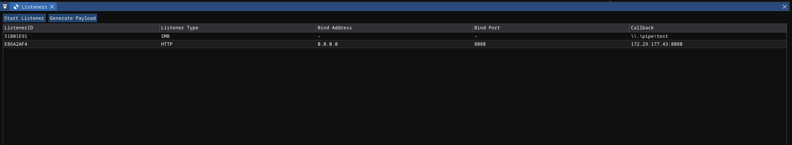
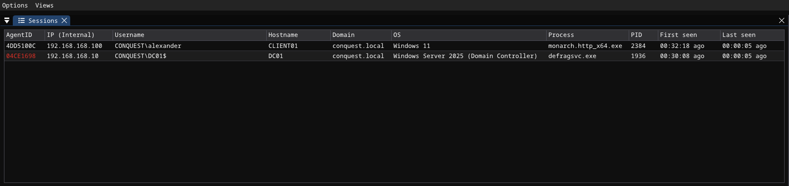
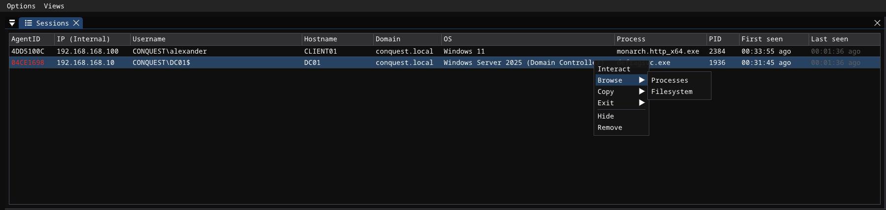
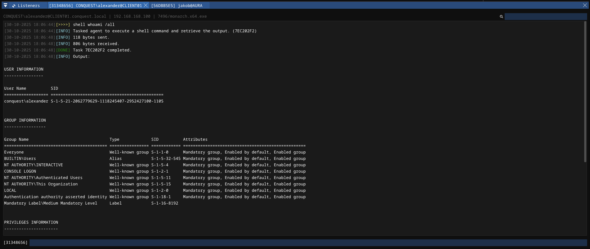
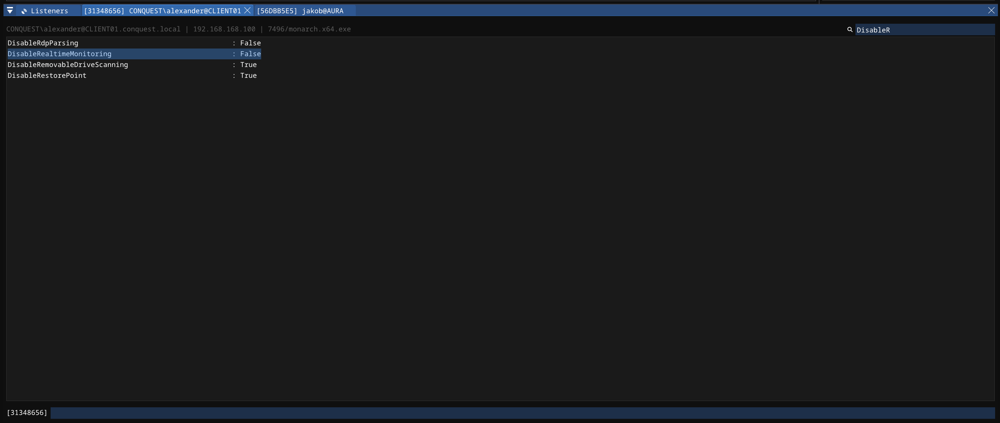
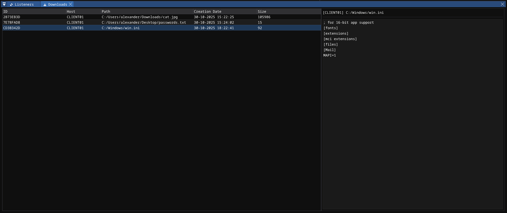
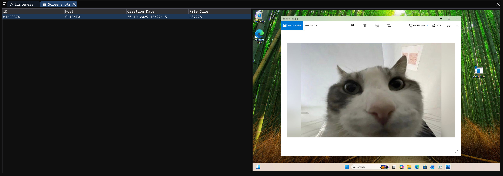

# Operator Client - User Interface <!-- omit from toc -->

## Contents  <!-- omit from toc -->

- [General](#general)
- [Listeners](#listeners)
- [Sessions](#sessions)
- [Agent Console](#agent-console)
- [Downloads](#downloads)
- [Screenshots](#screenshots)
- [Eventlog](#eventlog)

## General

Conquest's operator client is developed using a wrapper for the **Dear ImGui** library in Nim. It communicates via WebSocket with the team server to instruct it to perform various actions, such as starting listeners, generating payloads or tasking agents to execute commands. At the same time, it receives data from the team server, such as new agents, command output or files and updates the user interface in real-time. Dear ImGui makes it easy to reorder windows and components for a customizable and flexible user experience.  

## Listeners

The **Listeners** view shows a table with all currently active listeners and provides buttons for starting new listeners and for generating `Monarch` payloads. Right-clicking an active listeners opens a context menu that allows the user to stop the listener. 

## Sessions 

The **Sessions Table** view, located by default in the top left shows information about agents and the target system they are running on, such as the username, hostname, domain, internal and external IP address, process information and the time since the last heartbeat. By right-clicking the header row, columns can be hidden and shown, as well as reordered and resized.  

To interact with an agent, one can either double-click it, or right-click the row and select `Interact`. From this right-click context menu, it is also possible to exit the agent and remove it from the team server database, which is usually done to prevent inactive agents from reappearing after a client restart.  

It is also possible to select multiple rows by dragging or holding CTRL/SHIFT and performing actions on all selected rows simultaneously. 

## Agent Console 

An **Agent Console** is opened in the bottom panel when an agent is interacted with. It features an input field at the bottom where the command can be entered, a large textarea, where output can by selected and copied, as well as a search field for filtering the output. The console input field features tab-autocompletion for commands and supports searching through the command history using the up and down arrow keys. 

Available keyboard shortcuts: 

| Shortcut | Action |
| --- | --- |
| CTRL + F | Focuses search input | 
| CTRL + A | Highlight all output | 
| CTRL + C | Copy selection | 
| CTRL + V | Paste clipboard | 

## Downloads 

The **Downloads** view is hidden by default and can be enabled via the menu bar: `Views -> Loot -> Downloads`. By default, it opens in the bottom panel and displays information about the downloaded files on the left and the contents of the file on the right. The content is fetched from the team server when a loot row is selected for the first time.

Right-clicking a row opens a context menu with two options:

- Download: Download the file to disk
- Remove: Ask the team server to remove the loot item from the database

## Screenshots

Similar to the downloads, the **Screenshots** view is hidden by default and can be enabled by selecting `Views -> Loot -> Screenshots`. A preview of the screenshot is shown directly in the operator client. The ../assets/client can again be downloaded to disk by right-clicking the item and selecting `Download`.

## Eventlog

The **Eventlog** view is shown by default in the top right and displays general team server events, info messages and errors. 

