# Operator Client - User Interface <!-- omit from toc -->

## Contents  <!-- omit from toc -->

- [General](#general)
- [User Authentication](#user-authentication)
- [Listeners](#listeners)
- [Sessions](#sessions)
- [Agent Console](#agent-console)
- [Downloads](#downloads)
- [Screenshots](#screenshots)
- [Eventlog](#eventlog)
- [File Browser](#file-browser)
- [Process Browser](#process-browser)
- [Script Manager](#script-manager)
- [Operator Chat](#operator-chat)

## General

Conquest's operator client is developed using a wrapper for the **Dear ImGui** library in Nim. It communicates via WebSocket with the team server to instruct it to perform various actions, such as starting listeners, generating payloads or tasking agents to execute commands. At the same time, it receives data from the team server, such as new agents, command output or files and updates the user interface in real-time. Dear ImGui makes it easy to reorder windows and components for a customizable and flexible user experience.  

## User Authentication

When startin the client, the operator is met with the user authentication modal. Here, a valid set of credentials configured in the team server process needs to be entered in order to access the rest of the framework's features. When the information is entered and the `Connect` button is pressed, the client first connects to the team server via the WebSocket communciation for the key exchange. Once the key exchange is completed and both communication partners have access to the shared session key, the clients sends over the authentication information (username & password) in an encrypted message. If the credentials are valid, relevant data, such as sessions, listeners, loot and the C2 profile are synchronized with the client. If the authentication fails, an error message is displayed.

- "Cannot connect to team server.": Specified team server is not reachable.
- "Incorrect username or password.": The supplied credentials are not valid.

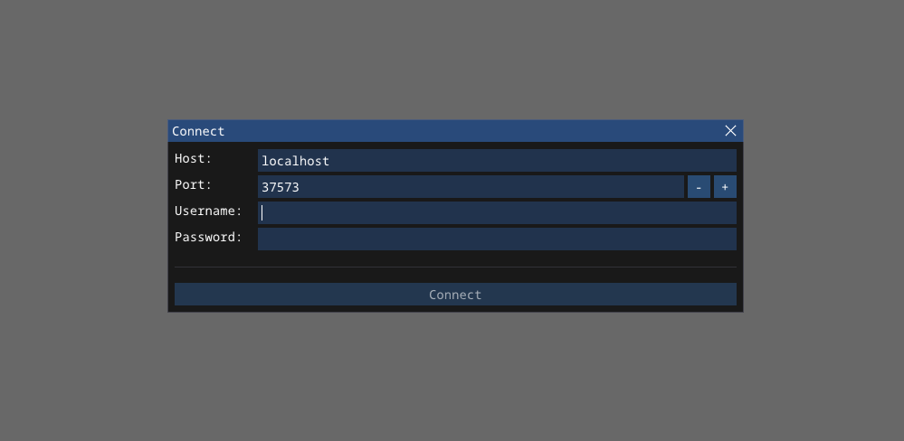

## Listeners

The **Listeners** view shows a table with all currently active listeners and provides buttons for starting new listeners and for generating `Monarch` payloads. Right-clicking an active listeners opens a context menu that allows the user to stop the listener and remove it from the team server database. 

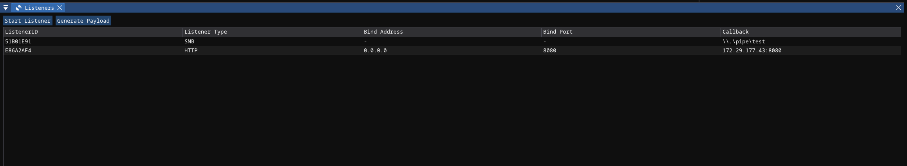

## Sessions 

The **Sessions Table** view, located by default in the top left shows information about agents and the target system they are running on, such as the username, hostname, domain, internal and external IP address, process information and the time since the last heartbeat. By right-clicking the header row, columns can be hidden and shown, as well as reordered and resized.  

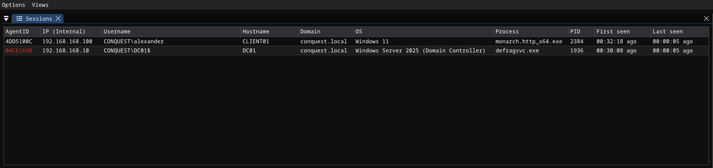

To interact with an agent, one can either double-click it, or right-click the row and select `Interact`. The right-click context menu supports additional features:

- Open file/process browser with the current agent selected.
- Copy any field of the session metadata (AgentID, username, hostname, ...). 
- Exit the process and remove it from the team server database.
  - Exit agent process
  - Exit agent thread
  - Self-destruct
- Hide agent from the sessions table without deleting it from the team server database.

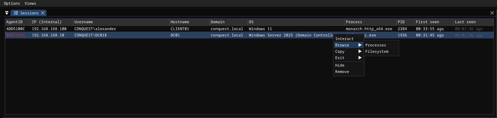

It is also possible to select multiple rows by dragging or holding CTRL/SHIFT and performing actions on all selected rows simultaneously. 

## Agent Console 

An **Agent Console** is opened in the bottom panel when an agent is interacted with. It features an input field at the bottom where the command can be entered, a large textarea, where output can by selected and copied, as well as a search field for filtering the output. The console input field features tab-autocompletion for commands and supports searching through the command history using the up and down arrow keys. 

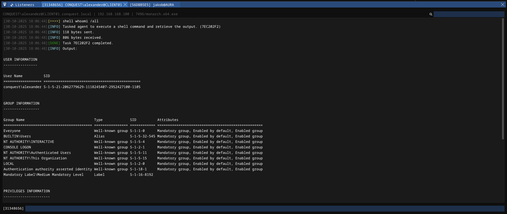
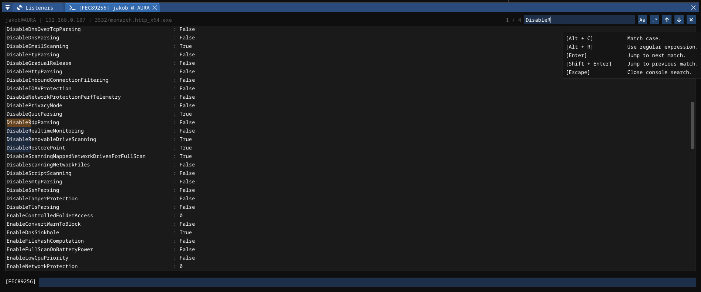

Available keyboard shortcuts: 

| Shortcut | Action |
| --- | --- |
| CTRL + F | Focuses search input | 
| CTRL + A | Highlight all output | 
| CTRL + C | Copy selection | 
| CTRL + V | Paste clipboard | 

## Downloads 

The **Downloads** view is hidden by default and can be enabled via the menu bar: `Views -> Loot -> Downloads`. By default, it opens in the bottom panel and displays information about the downloaded files on the left and the contents of the file on the right. The content is fetched from the team server when a loot row is selected for the first time.

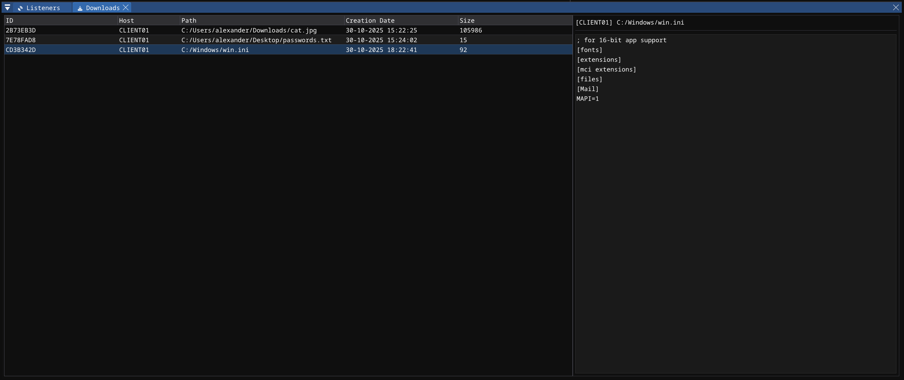

Right-clicking a row opens a context menu with two options:

- Download: Download the file to disk
- Remove: Ask the team server to remove the loot item from the database

## Screenshots

Similar to the downloads, the **Screenshots** view is hidden by default and can be enabled by selecting `Views -> Loot -> Screenshots`. A preview of the screenshot is shown directly in the operator client. The ../assets/client can again be downloaded to disk by right-clicking the item and selecting `Download`.

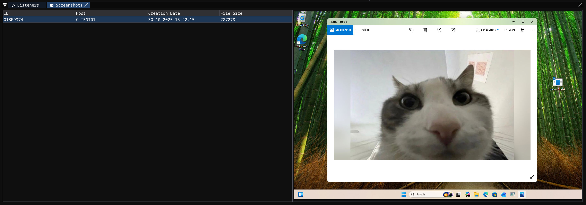

## Eventlog

The **Eventlog** view is shown by default in the top right and displays general team server events, info messages and errors. 

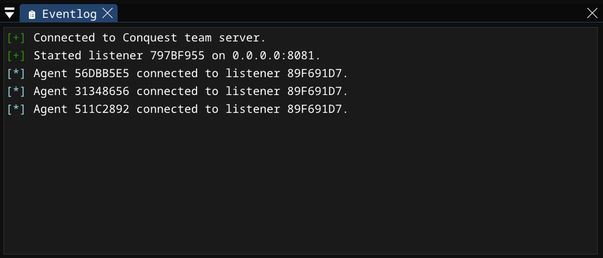

## File Browser

The **File Browser** provides a structured view of the compromised system's filesystem. It can be opened via `View -> File Browser` or by right-clicking a session and selecting `Browse -> Filesystem`, with the target agent selectable from the dropdown in the top left.

Directories already loaded via ls are shown with an open folder icon and highlighted in white. Unvisited directories are greyed out. Double-clicking a directory issues an ls command to retrieve its contents. Right-clicking a directory offers the option to change into it, while right-clicking a file triggers a direct download. Directory listings are cached automatically as the operator navigates the filesystem, even when the File Browser is not open.

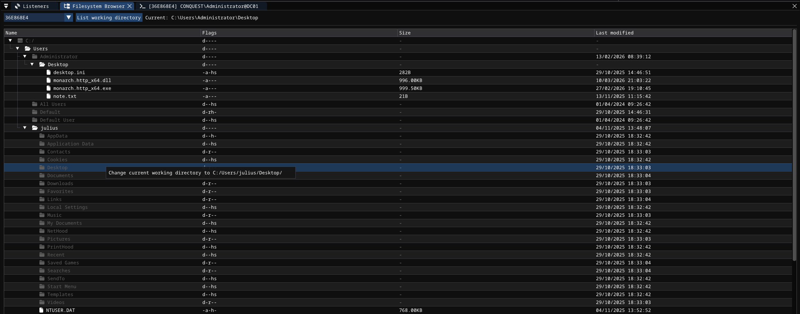

## Process Browser 

Similarly to the file browser, the **Process Browser** provides a table view of all processes running on the system. It can be opened via `View -> Process Browser` or by right-clicking a session and selecting `Browse -> Processes`, with the target agent selectable from the dropdown in the top left. 

The process list is refreshed either by running the ps command in the agent console or by clicking the refresh icon in the component. When the agent is running in a SYSTEM context, right-clicking a process offers the option to steal its token.

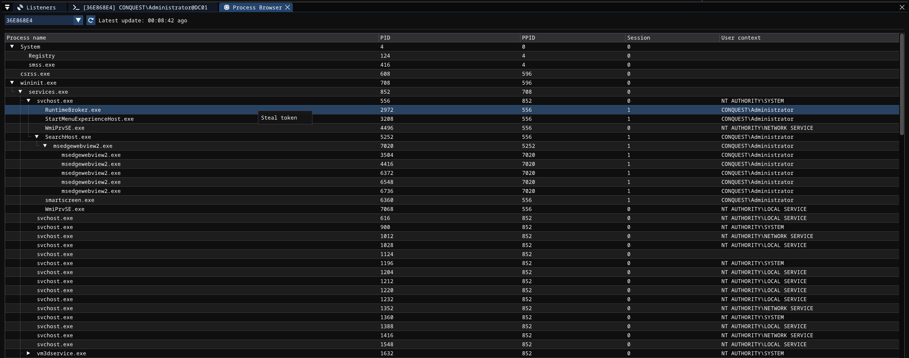

## Script Manager

The **Script Manager** component is used to load and unload Conquest Python Modules on the client. These modules define commands that can be used in the agent console. Clicking the `Load Script` button opens a file explorer where an appropriate file can be chosen. This UI component is hidden by default and can be shown by selecting `Views -> Script Manager`. When a loaded script contains a syntax error, it is highlighted in red as seen in the screenshot below. 

## Operator Chat

The **Chat** can be used to communicate with other operators that have logged on to the same team server. Messages sent by the current user are highlighted in yellow. The chat view can be shown by selecting `Views -> Chat`.

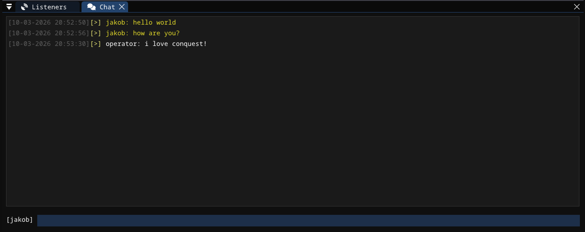