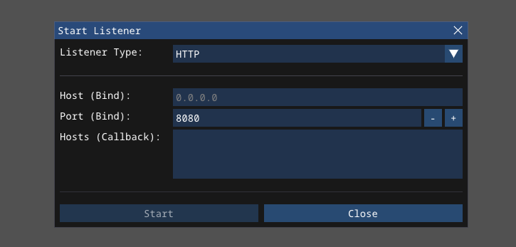

# Listeners <!-- omit from toc -->

Listeners can be started by pressing the **Start Listener** button in the **Listeners** view. This opens the following modal popup.

| Name | Description |
| --- | --- | 
| Protocol | Listener type. Currently only `http` listeners are implemented |
| Host (Bind) | IP address or interface that the listener binds to on the team server | 
| Port (Bind) | Port that the listeners bind to on the team server | 
| Hosts (Callback) | Callback hosts, one per line. The hosts are defined, separated by new-lines, in the format `<ip/domain>:<port>`. If no port is specified, the bind port is used instead. If no callback hosts are defined at all, the bind host and bind port are used. Callback hosts are the endpoints that the `Monarch` agent connects to. If multiple are defined, a random entry of the list of callback hosts is selected for each request.