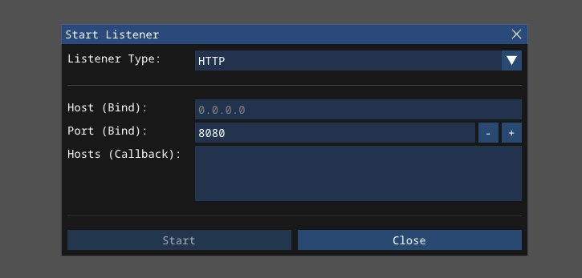
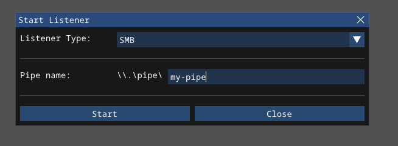

# Listeners <!-- omit from toc -->

Listeners can be started by pressing the **Start Listener** button in the **Listeners** view. This opens the following modal popup.

The listener protocol can be selected using the first dropdown menu. The following listeners are supported:

## HTTP Listeners

HTTP Listeners are used for outbound network traffic that directly reaches the team server or any C2 redirectors.

| Name | Type | Description |
| --- | --- | --- | 
| Host (Bind) | String |  IP address or interface that the listener binds to on the team server | 
| Port (Bind) | Integer | Port that the listeners bind to on the team server | 
| Hosts (Callback) | Multi-line String |  Callback hosts, one per line. The hosts are defined, separated by new-lines, in the format `<ip/domain>:<port>`. If no port is specified, the bind port is used instead. If no callback hosts are defined at all, the bind host and bind port are used. Callback hosts are the endpoints that the `Monarch` agent connects to. If multiple are defined, a random entry of the list of callback hosts is selected for each request.

## SMB Listeners

SMB listeners handle peer-to-peer connections between agents, useful for pivoting to internal targets where outbound HTTP traffic is restricted or would be particularly conspicuous. SMB agents create a SMB named pipe and require other agents to `link` them together in order to receive tasks and return results. Agents in the chain relay traffic between the SMB agent and the team server by forwarding packets. 

| Name | Type | Description |
| --- | --- |--- | 
| Pipe name | String | Name of the named pipe to create for SMB traffic (prefixed with `\\.\pipe\`) | 