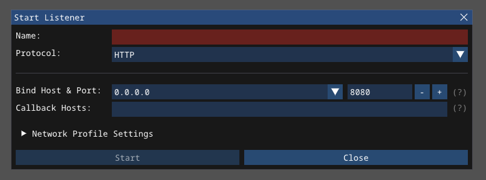
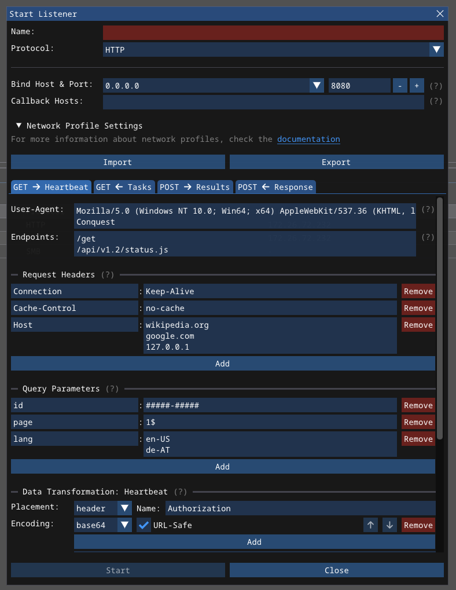
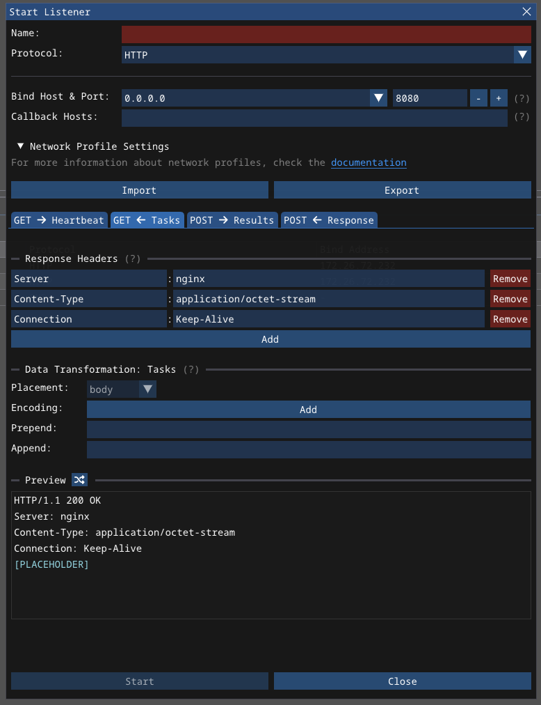
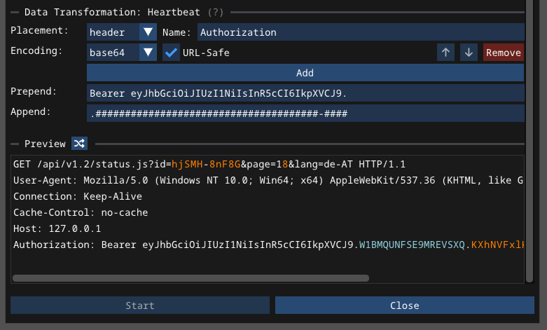
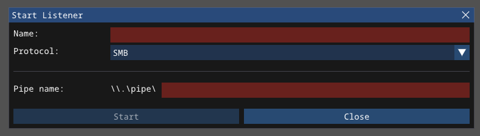

# Listeners <!-- omit from toc -->

Listeners can be started by pressing the **Start Listener** button in the **Listeners** view. This opens the following modal popup.

Aside from the configuration of the listener name, the listener protocol can be selected using the first dropdown menu. Currently, Conquest supports the following:

## HTTP Listeners

HTTP Listeners are used for outbound network traffic that directly reaches the team server or any C2 redirectors.

| Name | Type | Description |
| --- | --- | --- | 
| Host (Bind) | Dropdown |  IP address or interface that the listener binds to on the team server. The dropdown shows all possible interfaces on the team server. | 
| Port (Bind) | Integer | Port that the listeners bind to on the team server. The combination of the bind host and bind port needs to be unique. | 
| Hosts (Callback) | Multi-line String |  Callback hosts, one per line. The hosts are defined, separated by new-lines, in the format `<ip/domain>:<port>`. If no port is specified, the bind port is used instead. If no callback hosts are defined at all, the bind host and bind port are used. Callback hosts are the endpoints that the `Monarch` agent connects to. If multiple are defined, a random entry of the list of callback hosts is selected for each request.

### Profile overwrites

Expanding the *Network Profile Settings*, it is possible to overwrite the default profile that the team server was started with. Overwritten profile settings are stored on the listener object and team server database. The profile overwrites are divided into four sections: 

- **GET Request**: sent from agent to server (Heartbeat packet)
- **GET Response**: sent from server to agent (Tasks packet)
- **POST Request**: sent from agent to server (Task results and registration packet)
- **POST Response**: sent from server to agent 

The profile settings contain input validation that prevents the listener from being started when invalid configuration is detected. Refer to [3-PROFILE](./3-PROFILE.md) for rules and expected settings. The profile settings can be exported to a TOML profile using the **Export** button. Similarly, an existing Conquest profile can be imported directly in the listener modal using the **Import** button.

The *Preview* at the bottom of each tab should what the resulting HTTP request would look like. Pressing the **Shuffle** button applies randomization. 

## SMB Listeners

SMB listeners handle peer-to-peer connections between agents, useful for pivoting to internal targets where outbound HTTP traffic is restricted or would be particularly conspicuous. SMB agents create a SMB named pipe and require other agents to `link` them together in order to receive tasks and return results. Agents in the chain relay traffic between the SMB agent and the team server by forwarding packets. 

| Name | Type | Description |
| --- | --- |--- | 
| Pipe name | String | Name of the named pipe to create for SMB traffic (prefixed with `\\.\pipe\`) | 