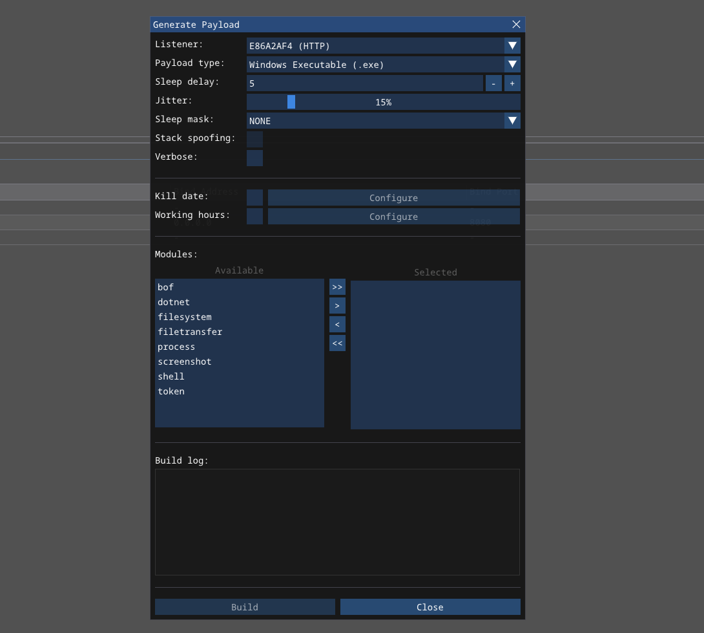
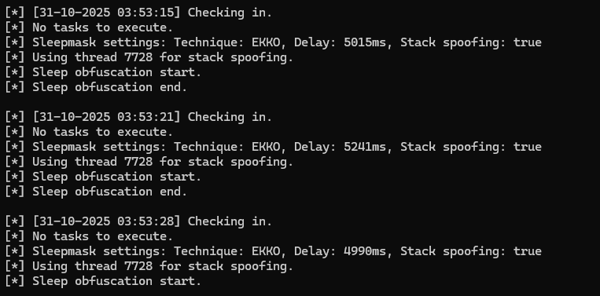
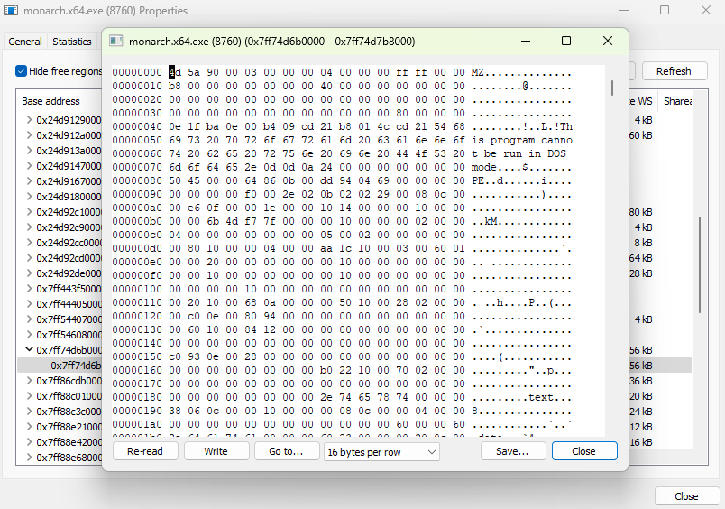
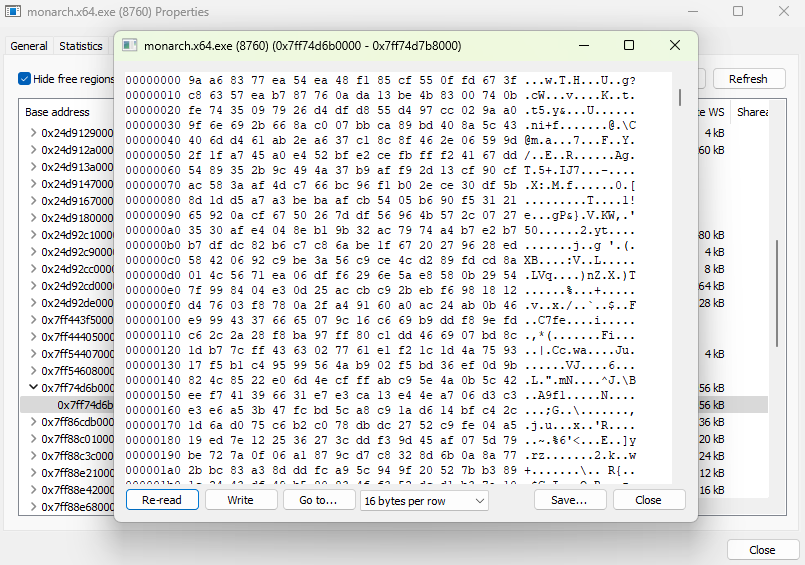
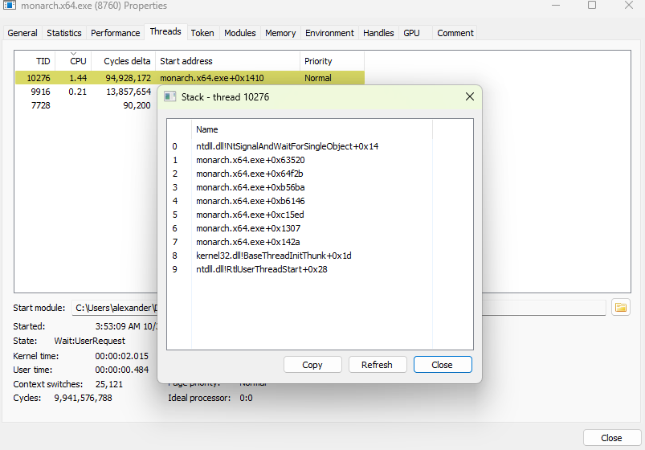
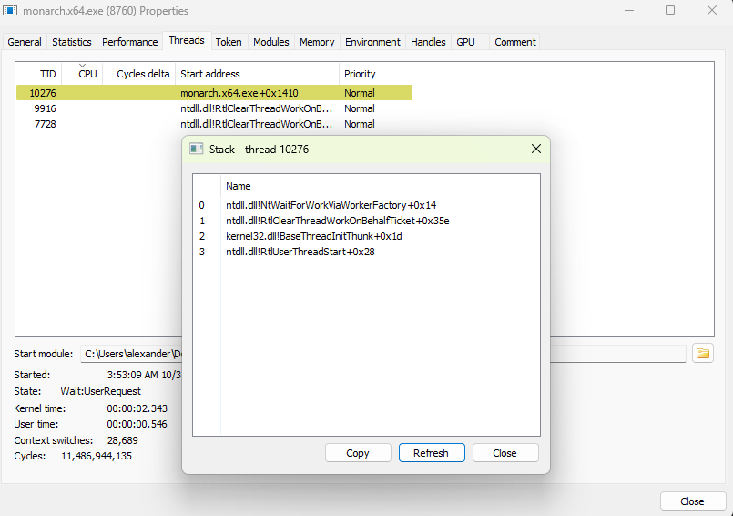
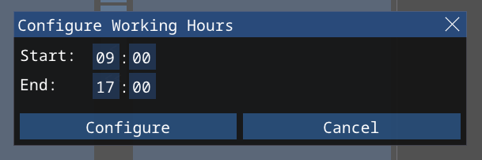
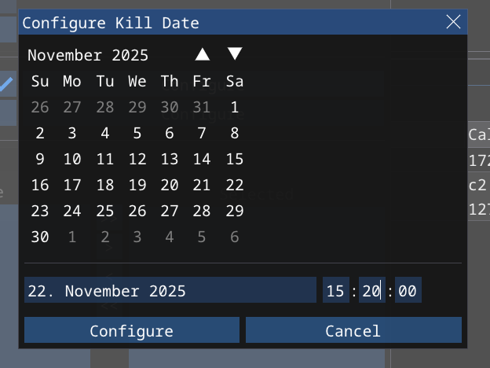

# Agents <!-- omit from toc --> 

## Contents  <!-- omit from toc -->

- [The Monarch](#the-monarch)
- [Sleep settings](#sleep-settings)
  - [Sleep Obfuscation](#sleep-obfuscation)
    - [Stack Spoofing](#stack-spoofing)
  - [Working hours](#working-hours)
- [Kill date](#kill-date)
- [String obfuscation](#string-obfuscation)
- [Evasion](#evasion)

## The Monarch

The `Monarch` agent is Conquest's built-in agent that can be used to command and control Windows targets using a variety of post-exploitation modules. It can be customized using the payload generation modal pop-up, which is opened by pressing the **Generate Payload** button in the **Listeners** view.



When the `Monarch` is built, it is embedded with a large placeholder field that is then patched with the agent configuration, such as the listener information, sleep settings, C2 profile and team server's public key. The agent generation modal has numerous settings, which are explained below and in subsequent sections.

| Setting | Type | Description |
| --- | --- | --- | 
| Listener | Dropdown selection | ID of the listener the agent with be configured to connect to. | 
| Verbose | Boolean | Enable/Disable verbose mode. When this checkbox is checked, the agent prints debug messages in the console. |
| Modules | Dual list selection | Select the modules that are to be built into the agent. Highlighting a module shows a brief description and the included commands. More on modules can be found [here](./7-MODULES.md). |

The build log shows the state of the agent build process. When the build is finished, a file dialog is opened on the client that prompts the operator to choose where to save the `Monarch` executable.

## Sleep settings

Aside from the general settings explained above, a major aspect of the `Monarch` agent is the ability to configure the sleep settings. 

| Setting | Type | Description | 
| --- |  --- | --- | 
| Sleep delay | Integer | Sleep delay between heartbeat requests in seconds. |
| Jitter | Integer (0-100) | Sleep jitter in %. For example, if a sleep delay of 10 seconds and a jitter of 50% is configured, the final sleep delay can be anything between 5 and 15 seconds. | 
| Sleep mask | Dropdown | Sleep obfuscation technique to use. Available options are `EKKO`, `ZILEAN`, `FOLIAGE` and `NONE` (default). | 
| Stack spoofing | Boolean | When enabled, the agent performs call spoofs the call stack during while sleeping using stack duplication. This setting is only available for the sleep obfuscation techniques `EKKO` and `ZILEAN`. | 
| Working hours | Configuration | Timeframe, within which the agent sends heartbeat messages.



### Sleep Obfuscation

When configured, sleep obfuscation is used by the `Monarch` agent to hide itself from memory scanners in between heartbeat requests. In general, sleep obfuscation, also called sleepmask, is a technique that allows a C2 agent to encrypt it's own memory before a sleep cycle, delay the execution and then decrypt itself to make a request again. 

When the agent doesn't use sleep obfuscation, or when the sleep delay is over, the memory looks as follows:



However, while the agent is asleep, the memory is encrypted using `SystemFunction32` with a random RC4 encryption key.



Conquest supports the following sleep obfuscation techniques: 

| Sleep obfuscation technique | Description | 
| --- | --- | 
| NONE | Uses a regular `Sleep` call for the delay. Does not encrypt agent memory. | 
| EKKO | Ekko sleep obfuscation by C5pider based on the implementation shown in Maldev Academy. Uses `RtlCreateTimer` to perform sleep obfuscation. |
| ZILEAN | Zilean sleep obfuscation by C5pider. Similar to Ekko, but uses `RtlRegisterWait` instead. |
| FOLIAGE | Foliage sleep obfuscation based on Asynchronous Procedure Calls. | 

#### Stack Spoofing

Without stack spoofing, the thread stack of the agent process displays the call to `NtSignalAndWaitForSingleObject`, which is the API responsible for the delay.



With stack spoofing enabled, the call stack of another thread is duplicated to hide these suspicious function calls. 



### Working hours

Working hours can be enabled and configured by checking the checkbox and clicking **Configure** in the agent generation modal. It is possible to select a start and end time in the HH:mm format. Within working hours, an agent sends requests to the team server as expected. When the agent detects that it is outside of working hours however, it calculates the sleep delay needed to reach the next workday (e.g. 09:00 the following day) and sleeps until then. This provides more operational security, because no network traffic is sent at unreasonable times. 

Working hours considers the **local** system time to determine if the agent is within working hours.



## Kill date 

The agent kill date can be configured by checking the checkbox and clicking **Configure** in the agent generation modal to have an agent process terminate when a specific date/time is reached. For instance, it can be set to the end date and time of a penetration test to prevent the testers from interacting with implants after the test has ended. 

Kill date uses **UTC** time.



## String obfuscation

Compile-time string obfuscation is implemented using Nim's extensive macro and meta-programming system. Static strings, such as the keys to profile settings are XOR-ed at compile time with a randomized key so they don't show up in binary, when using the `strings` command for instance. 

```nim
# Compile-time string encryption using simple XOR
# This is done to hide sensitive strings, such as C2 profile settings in the binary 
# https://github.com/S3cur3Th1sSh1t/nim-strenc/blob/main/src/strenc.nim
proc calculate(str: string, key: int): string {.noinline.} = 
    var k = key 
    var bytes = string.toBytes(str)
    for i in 0 ..< bytes.len:
        for f in [0, 8, 16, 24]: 
            bytes[i] = bytes[i] xor uint8((k shr f) and 0xFF)
        k = k +% 1
    return Bytes.toString(bytes)

# Generate a XOR key at compile-time. The `and` operation ensures that a positive integer is the result
var key {.compileTime.}: int = hash(CompileTime & CompileDate) and 0x7FFFFFFF

macro protect*(str: untyped): untyped = 
    var encStr = calculate($str, key)
    result = quote do: 
        calculate(`encStr`, `key`)
    
    # Alternate the XOR key using the FNV prime (1677619)
    key = (key *% 1677619) and 0x7FFFFFFF
```

String obfuscation is not enabled for debug messages when using verbose mode.  

## Evasion 

While the `Monarch` offers some evasive functionality, such as sleep and string obfuscation and more, it was not specifically designed to be as evasive as possible. It is not guaranteed or even expected that the payload evades all AV/EDR software, as it has not been developed with that capability as a priority. Evasiveness and operational security are the responsibilities of the operator, not the author of this framework.
