# Agents <!-- omit from toc --> 

## Contents  <!-- omit from toc -->

- [The Monarch](#the-monarch)
- [Tab 1: General Settings](#tab-1-general-settings)
- [Tab 2: Sleep Settings](#tab-2-sleep-settings)
  - [Sleep Obfuscation](#sleep-obfuscation)
    - [Stack Spoofing](#stack-spoofing)
  - [Working hours](#working-hours)
- [Tab 3: Execution Guardrails](#tab-3-execution-guardrails)
  - [Kill date](#kill-date)
- [Tab 4: Modules](#tab-4-modules)
- [Tab 5: Importing \& Exporting Build Configurations](#tab-5-importing--exporting-build-configurations)
- [Tab 6: Building](#tab-6-building)
- [Evasion](#evasion)
  - [String obfuscation](#string-obfuscation)

## The Monarch

The `Monarch` agent is Conquest's built-in agent that can be used to command and control Windows targets using a variety of post-exploitation modules. It can be customized using the payload generation modal pop-up, which is opened by pressing the **Generate Payload** button in the **Listeners** view.


When the `Monarch` is built, it is embedded with a large placeholder field that is then patched with the agent configuration, such as the listener information, sleep settings, C2 profile and team server's public key. The agent generation modal is divided into several categories with different configuration options. The tabs in the payload generation modal are highlighted in red, if the applied configuration contains errors.

## Tab 1: General Settings

| Setting | Type | Description |
| --- | --- | --- | 
| Agent | Dropdown selection | Agent type. Currently, only the `Monarch` agent can be built using the Conquest operator client. | 
| Payload type | Dropdown selection | Type of payload to create. The following payload types are available: <br> - Windows Executable (.exe)<br> - Windows DLL (.dll)<br> - Windows Service Executable (.svc.exe) | 
| Listener | Dropdown selection | ID of the listener the agent will be configured to connect to. | 
| Verbose | Boolean | Enable/Disable verbose mode. When this checkbox is checked, the agent prints debug messages in the console. |

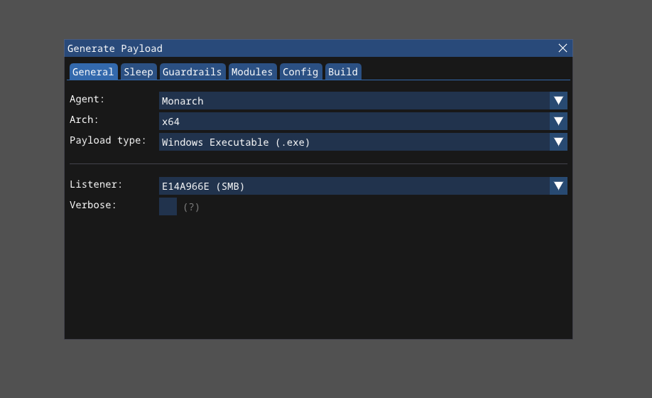

## Tab 2: Sleep Settings

Aside from the general settings explained above, a major aspect of the `Monarch` agent is the ability to configure the sleep settings. 

| Setting | Type | Description | 
| --- |  --- | --- | 
| Sleep delay | Integer | Sleep delay between heartbeat requests in seconds. |
| Jitter | Integer (0-100) | Sleep jitter in %. For example, if a sleep delay of 10 seconds and a jitter of 50% is configured, the final sleep delay can be anything between 5 and 15 seconds. | 
| Sleep mask | Dropdown | Sleep obfuscation technique to use. Available options are `EKKO`, `ZILEAN`, `FOLIAGE` and `NONE` (default). | 
| Stack spoofing | Boolean | When enabled, the agent spoofs the call stack while sleeping using stack duplication. This setting is only available for the sleep obfuscation techniques `EKKO` and `ZILEAN`. | 
| Working hours | Configuration | Timeframe, within which the agent sends heartbeat messages.

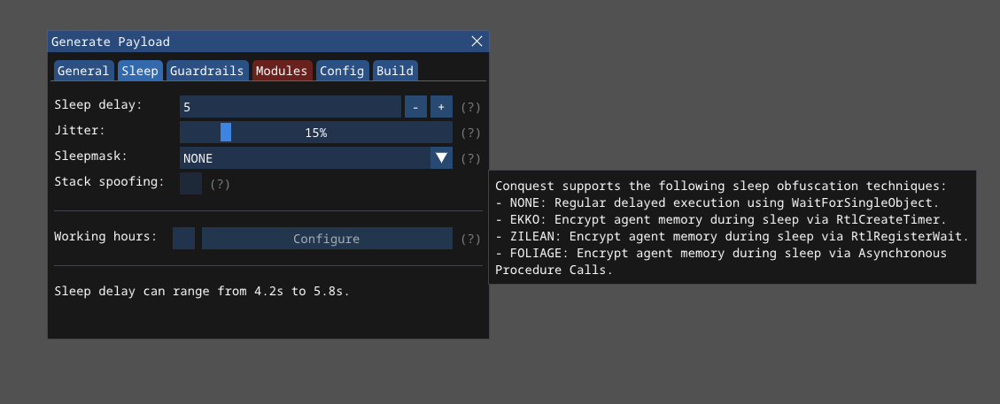

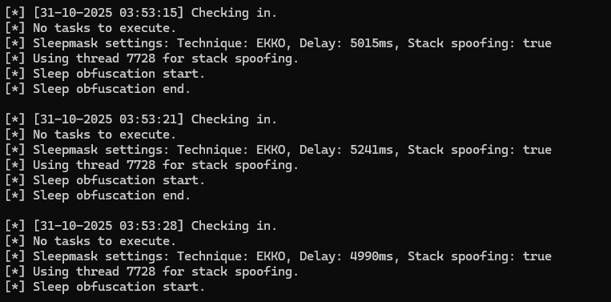

### Sleep Obfuscation

When configured, sleep obfuscation is used by the `Monarch` agent to hide itself from memory scanners in between heartbeat requests. In general, sleep obfuscation, also called sleepmask, is a technique that allows a C2 agent to encrypt its own memory before a sleep cycle, delay the execution and then decrypt itself to make a request again. 

When the agent doesn't use sleep obfuscation, or when the sleep delay is over, the memory looks as follows:

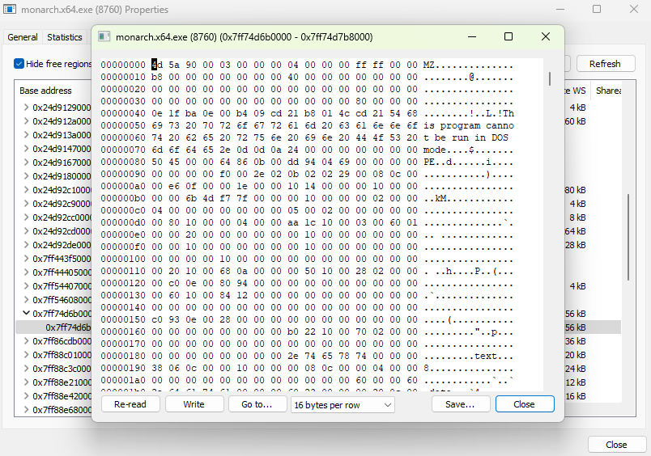

However, while the agent is asleep, the memory is encrypted using `SystemFunction32` with a random RC4 encryption key.

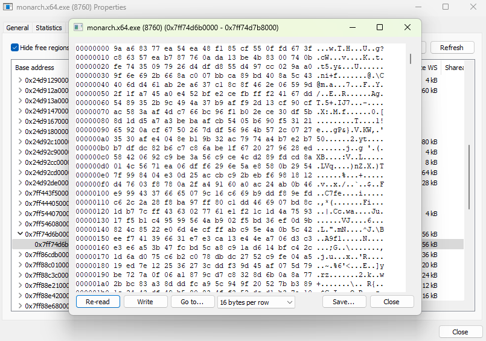

Conquest supports the following sleep obfuscation techniques: 

| Sleep obfuscation technique | Description | 
| --- | --- | 
| NONE | Uses a regular `Sleep` call for the delay. Does not encrypt agent memory. | 
| EKKO | Ekko sleep obfuscation by C5pider based on the implementation shown in Maldev Academy. Uses `RtlCreateTimer` to perform sleep obfuscation. |
| ZILEAN | Zilean sleep obfuscation by C5pider. Similar to Ekko, but uses `RtlRegisterWait` instead. |
| FOLIAGE | Foliage sleep obfuscation based on Asynchronous Procedure Calls. | 

#### Stack Spoofing

Without stack spoofing, the thread stack of the agent process displays the call to `NtSignalAndWaitForSingleObject`, which is the API responsible for the delay.

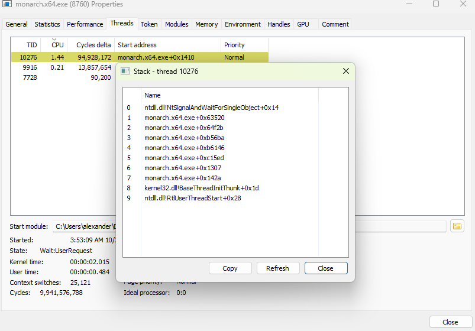

With stack spoofing enabled, the call stack of another thread is duplicated to hide these suspicious function calls. 

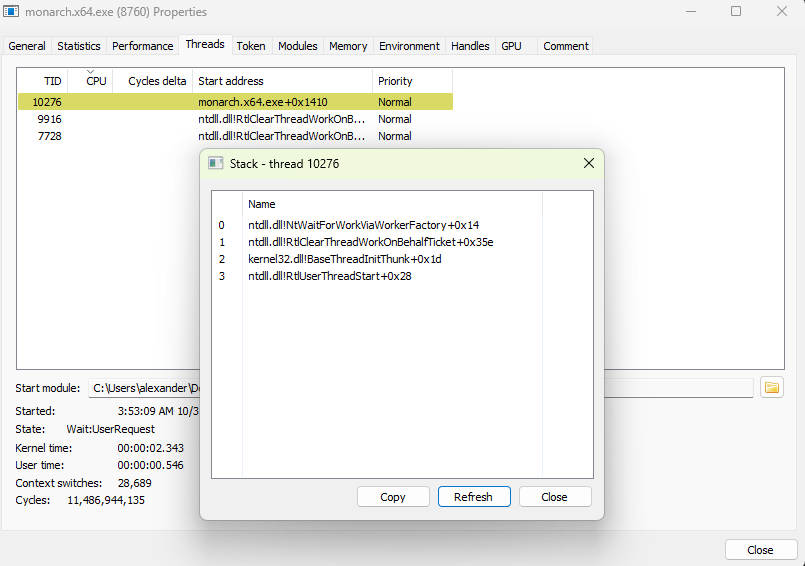

### Working hours

Working hours can be enabled and configured by checking the checkbox and clicking **Configure** in the agent generation modal. It is possible to select a start and end time in the HH:mm format. Within working hours, an agent sends requests to the team server as expected. When the agent detects that it is outside of working hours however, it calculates the sleep delay needed to reach the next workday (e.g. 09:00 the following day) and sleeps until then. This provides more operational security, because no network traffic is sent at unreasonable times. 

Working hours considers the **local** system time to determine if the agent is within working hours.

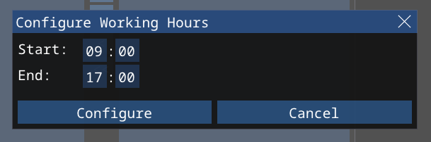


## Tab 3: Execution Guardrails 

Execution guardrails are used to prevent the agent from running on systems where it is not intended to run, such as sandboxes or out-of-scope hosts. Each guardrail is checked before the agent registers. The agent is terminated if at least one guardrail fails to match. 

All text-based guardrail patterns support wildcards (`*` to match any sequence of characters, `?` to match a single character) and negation (prefix with `!`). Multiple entries are separated by commas.

| Setting | Type | Description |
| --- | --- | --- |
| Domain | Text input | Restrict execution to domain-joined hosts. Optionally provide a comma-separated list of AD domain patterns to match against. Leave the input empty to match any domain-joined host. |
| IP Address | Text input | Restrict execution to hosts whose IP address matches one of the comma-separated patterns provided. |
| Hostname | Text input | Restrict execution to hosts whose hostname matches one of the comma-separated patterns provided. |
| Kill date | Date & Time | Terminate the agent when the configured UTC date and time is reached. |

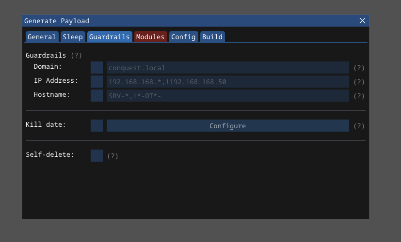

### Kill date 

The kill date can be configured by checking the checkbox and clicking **Configure** to open the date/time picker. The agent terminates when the configured timestamp is reached, regardless of what task it is currently executing. This can be used to ensure implants are automatically disabled at the end of a penetration test.

Kill date uses **UTC** time.

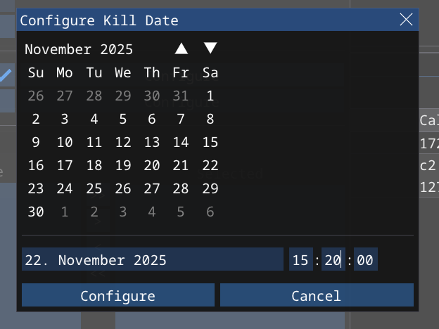

## Tab 4: Modules 

Modules are bundles of commands that are compiled into the agent binary at build time. Only commands belonging to selected modules are available after deployment. Selecting fewer modules reduces the binary size and thus the agent's attack surface. Hovering over a module shows a brief description and the commands it provides. At least one module must be selected to build the agent. This is done by double-clicking a module on the left side of the dual list selection box or highlighting it and using the arrow buttons to move it to the right.

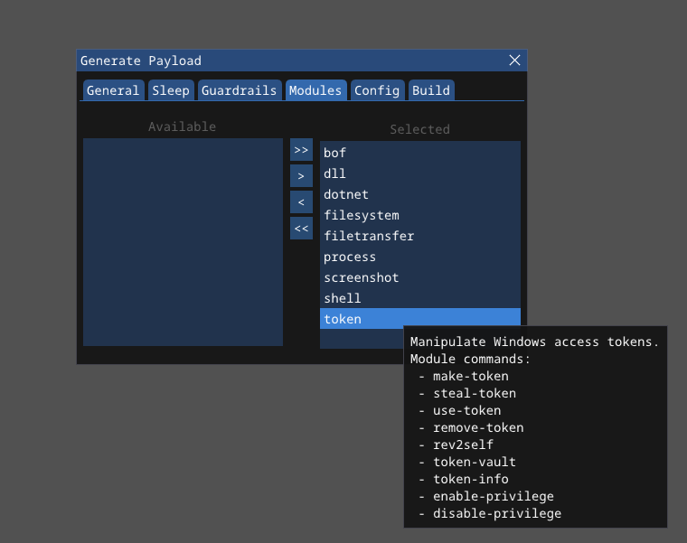

Full command references for each module are documented in [Core Modules](./7-MODULES.md).

## Tab 5: Importing & Exporting Build Configurations

The `Config` tab provides a live preview of the current build configuration as a JSON object, updated in real time as settings are changed across all other tabs. Build settings can be exported to `.json` config files or imported from the file system. Only valid configurations without errors can be exported.

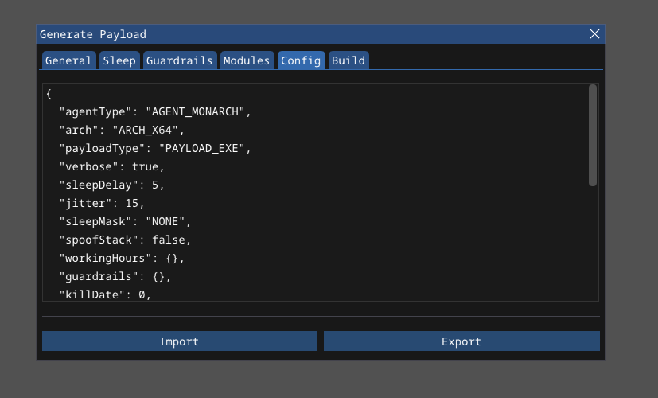

The JSON files have the following layout and keys: 

| Key | Description |
| --- | --- |
| `agentType` | Agent type. |
| `arch` | Target architecture. |
| `payloadType` | Payload type string. |
| `verbose` | `true` or `false`. |
| `sleepDelay` | Sleep delay in seconds. |
| `jitter` | Jitter percentage (0–100). |
| `sleepMask` | Sleep obfuscation technique (e.g. `EKKO`). |
| `spoofStack` | `true` or `false`. |
| `guardrails` | Object containing optional `domain`, `ip`, and `hostname` pattern strings. |
| `killDate` | Unix timestamp (UTC) of the kill date, or `0` if not set. |
| `workingHours` | Object containing `startHour`, `startMinute`, `endHour`, `endMinute`, or empty if not set. |
| `modules` | Array of module name strings selected for the build. |

Example: 

```json
{
  "agentType": "Monarch",
  "arch": "x64",
  "payloadType": "Windows Executable (.exe)",
  "verbose": true,
  "sleepDelay": 6,
  "jitter": 15,
  "sleepMask": "EKKO",
  "spoofStack": true,
  "guardrails": {
    "ip": "10.0.5.*",
    "hostname": "!DC01"
  },
  "killDate": 1780531200,
  "workingHours": {},
  "modules": [
    "bof",
    "dll",
    "dotnet",
    "filesystem",
    "filetransfer",
    "process",
    "screenshot",
    "shell",
    "token"
  ]
}
```

## Tab 6: Building 

The build log shows the state of the agent build process. When the build is finished, a file dialog is opened on the client that prompts the operator to choose where to save the `Monarch` executable. By default, payloads are stored using the following naming scheme: `monarch.<protocol>_<arch>.<extension>`

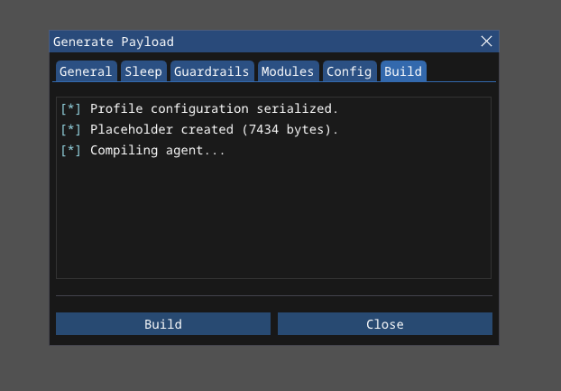

## Evasion

While the `Monarch` offers some evasive functionality, such as sleep and string obfuscation and more, it was not specifically designed to be as evasive as possible. It is not guaranteed or even expected that the payload evades all AV/EDR software, as it has not been developed with that capability as a priority. Evasiveness and operational security are the responsibilities of the operator, not the author of this framework.

### String obfuscation

Compile-time string obfuscation is implemented using Nim's extensive macro and meta-programming system. Static strings, such as the keys to profile settings are XOR-ed at compile time with a randomized key so they don't show up in the binary, when using the `strings` command for instance. 

```nim
# Compile-time string encryption using simple XOR
# This is done to hide sensitive strings, such as C2 profile settings in the binary 
# https://github.com/S3cur3Th1sSh1t/nim-strenc/blob/main/src/strenc.nim
proc calculate(str: string, key: int): string {.noinline.} = 
    var k = key 
    var bytes = string.toBytes(str)
    for i in 0 ..< bytes.len:
        for f in [0, 8, 16, 24]: 
            bytes[i] = bytes[i] xor uint8((k shr f) and 0xFF)
        k = k +% 1
    return Bytes.toString(bytes)

# Generate a XOR key at compile-time. The `and` operation ensures that a positive integer is the result
var key {.compileTime.}: int = hash(CompileTime & CompileDate) and 0x7FFFFFFF

macro protect*(str: untyped): untyped = 
    var encStr = calculate($str, key)
    result = quote do: 
        calculate(`encStr`, `key`)
    
    # Alternate the XOR key using the FNV prime (1677619)
    key = (key *% 1677619) and 0x7FFFFFFF
```

String obfuscation is not enabled for debug messages when using verbose mode.  


