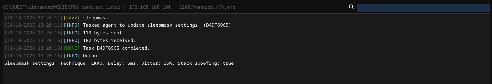
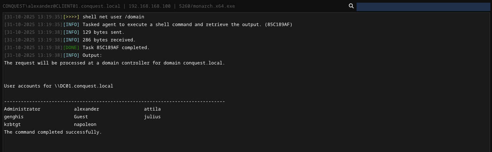
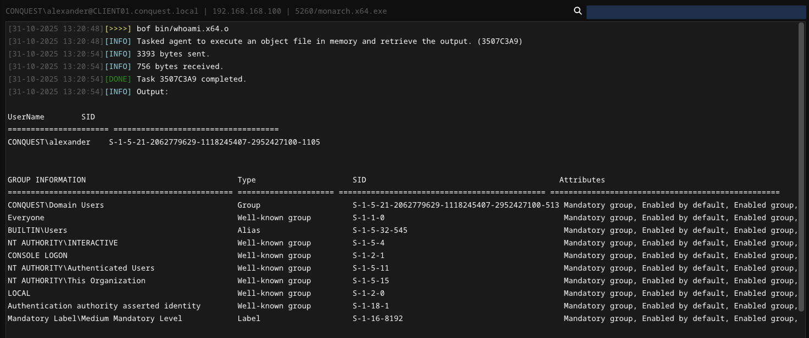
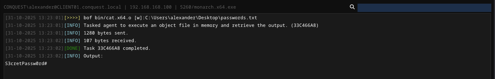
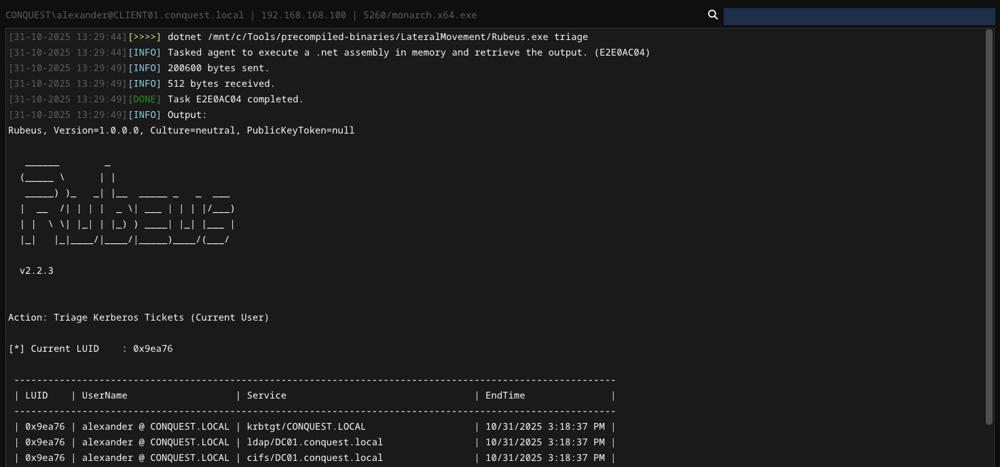
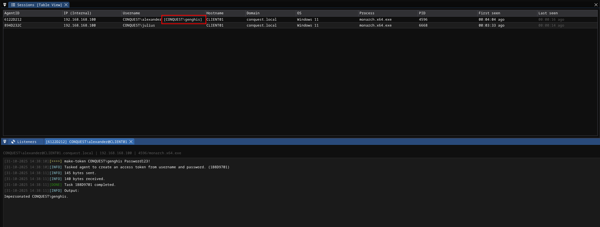
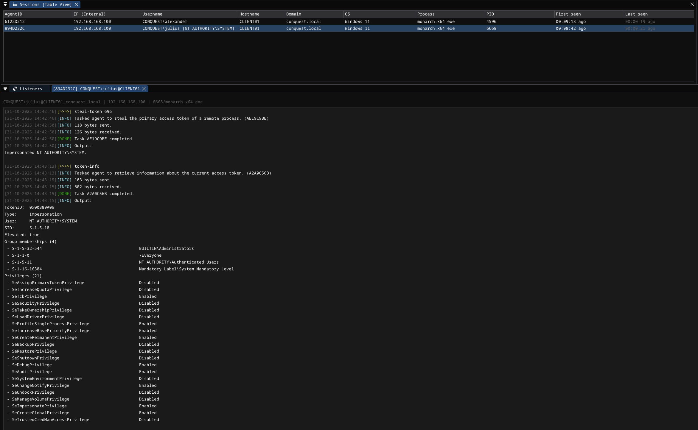
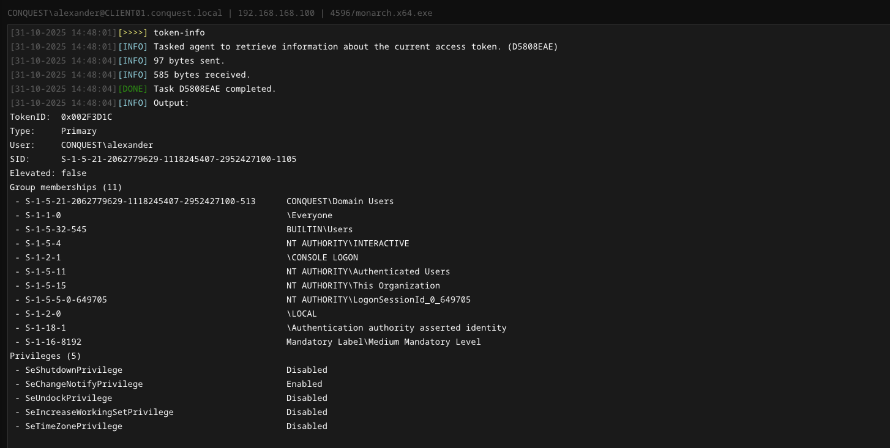
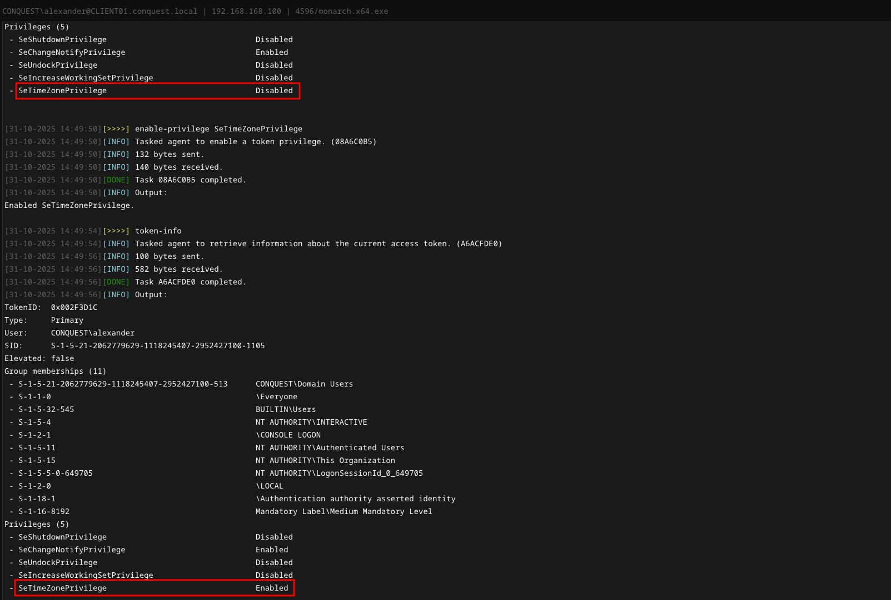
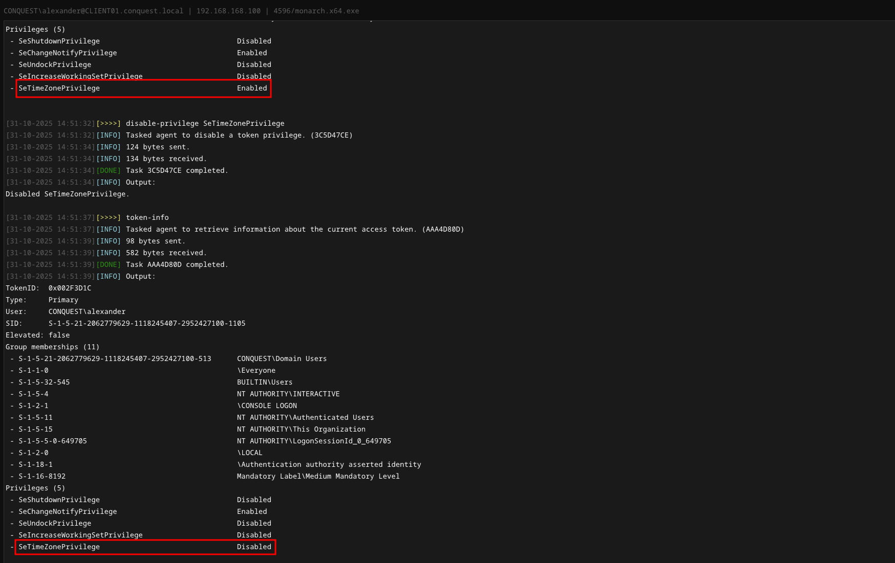

# Modules <!-- omit from toc -->

## Contents <!-- omit from toc -->

- [Overview](#overview)
- [EXIT](#exit)
  - [exit](#exit-1)
  - [self-destruct](#self-destruct)
- [SLEEP](#sleep)
  - [sleep](#sleep-1)
  - [sleepmask](#sleepmask)
- [SHELL](#shell)
  - [shell](#shell-1)
- [BOF](#bof)
  - [bof](#bof-1)
- [DOTNET](#dotnet)
  - [dotnet](#dotnet-1)
- [FILESYSTEM](#filesystem)
  - [pwd](#pwd)
  - [cd](#cd)
  - [ls](#ls)
  - [rm](#rm)
  - [rmdir](#rmdir)
  - [move](#move)
  - [copy](#copy)
- [FILETRANSFER](#filetransfer)
  - [download](#download)
  - [upload](#upload)
- [SCREENSHOT](#screenshot)
  - [screenshot](#screenshot-1)
- [SYSTEMINFO](#systeminfo)
  - [ps](#ps)
  - [env](#env)
- [TOKEN](#token)
  - [make-token](#make-token)
  - [steal-token](#steal-token)
  - [rev2self](#rev2self)
  - [token-info](#token-info)
  - [enable-privilege](#enable-privilege)
  - [disable-privilege](#disable-privilege)

## Overview

Modules are bundles of agent commands that can be embedded into the executable when configuring and building the `Monarch` agent. Currently, the following commands are available when all modules are activated.

```
 * exit                     Exit the agent.
 * self-destruct            Exit the agent and delete the executable from disk.
 * sleep                    Update sleep delay settings.
 * sleepmask                Update sleepmask settings.
 * shell                    Execute a shell command and retrieve the output.
 * bof                      Execute an object file in memory and retrieve the output.
 * dotnet                   Execute a .NET assembly in memory and retrieve the output.
 * pwd                      Retrieve current working directory.
 * cd                       Change current working directory.
 * ls                       List files and directories.
 * rm                       Remove a file.
 * rmdir                    Remove a directory.
 * move                     Move a file or directory.
 * copy                     Copy a file or directory.
 * download                 Download a file.
 * upload                   Upload a file.
 * screenshot               Take a screenshot of the target system.
 * ps                       Display running processes.
 * env                      Display environment variables.
 * make-token               Create an access token from username and password.
 * steal-token              Steal the primary access token of a remote process.
 * rev2self                 Revert to original access token.
 * token-info               Retrieve information about the current access token.
 * enable-privilege         Enable a token privilege.
 * disable-privilege        Disable a token privilege.
```

## EXIT 

Though not necessarily a module that can be enabled via the payload builder, the `exit` module exposes two commands that are built into the agent by default. 

### exit
Terminate the agent process or thread. This command is also invoked when the agent is exited from the UI. 

```
Usage    : exit [type]
Example  : exit process

Arguments:
   Name            Type   Required Description
   --------------- ------ -------- --------------------
 * type            STRING       NO Available options: PROCESS/THREAD. Default: PROCESS.
```

### self-destruct
Terminate the agent process and delete the agent executable from disk. 
```
Usage    : self-destruct 
Example  : self-destruct
```

## SLEEP 
The `sleep` module is used to change sleep settings dynamically on the agent.

### sleep 
Update sleep delay.

```
Usage    : sleep <delay>
Example  : sleep 5

Arguments:
   Name            Type   Required Description
   --------------- ------ -------- --------------------
 * delay           INT         YES Delay in seconds.
```

### sleepmask
Update sleepmask/sleep obfuscation settings. Executing without arguments retrieves the current sleepmask settings and prints them in the agent console.

```
Usage    : sleepmask [technique] [spoof]
Example  : sleepmask ekko true

Arguments:
   Name            Type   Required Description
   --------------- ------ -------- --------------------
 * technique       STRING       NO Sleep obfuscation technique (NONE, EKKO, ZILEAN, FOLIAGE).
 * spoof           BOOL         NO Use stack spoofing to obfuscate the call stack.
```



## SHELL 
The `shell` module is a simple module for executing shell commands using Nim's `execCmdEx` function. Double-quoted strings are parsed as a single argument. 

### shell
Execute a shell command and retrieve the output 

```
Usage    : shell <command> [arguments]
Example  : shell whoami /all

Arguments:
   Name            Type   Required Description
   --------------- ------ -------- --------------------
 * command         STRING      YES Command to be executed.
 * arguments       STRING       NO Arguments to be passed to the command.
 ```



## BOF
The `bof` module provides an effective BOF/COFF loader that can be used to execute beacon object files (*.o) in-memory. The object file is read from disk on the operator client and sent to the agent as part of the task data.

### bof 
Execute an object file in memory and retrieve the output.

```
Usage    : bof <path> [arguments]
Example  : bof /path/to/dir.x64.o C:\Users

Arguments:
   Name            Type   Required Description
   --------------- ------ -------- --------------------
 * path            BINARY      YES Path to the object file to execute.
 * arguments       STRING       NO Arguments to be passed to the object file. Arguments are handled as STRING, unless specified with a prefix
```



Arguments are handled as STRING by default, but some BOFs expect other types. Prefixes can be used to tell the BOF loader how to process the passed argument.

| Prefix | Type | 
| --- | --- | 
| `[i]:` | Integer |
| `[w]:` | Wide String | 
| `[s]:` | Short | 




## DOTNET

The `dotnet` module executes a .NET assembly in memory using the CLR. As with object files, the .NET assembly is read from the operator desktop. In order to prevent security software from blocking the execution, this module patches AMSI and ETW using hardware breakpoints.

### dotnet
Execute a .NET assembly in memory and retrieve the output.

```
Usage    : dotnet <path> [arguments]
Example  : dotnet /path/to/Seatbelt.exe antivirus

Arguments:
   Name            Type   Required Description
   --------------- ------ -------- --------------------
 * path            BINARY      YES Path to the .NET assembly file to execute.
 * arguments       STRING       NO Arguments to be passed to the assembly. Arguments are handled as STRING
```



## FILESYSTEM
The `filesystem` module features basic commands that have been implemented using the Windows API for interacting with the file system. Supports quoted arguments.

### pwd
Retrieve current working directory.

```
Usage    : pwd 
Example  : pwd
```

### cd
Change current working directory.

```
Usage    : cd <directory>
Example  : cd C:\Windows\Tasks

Arguments:
   Name            Type   Required Description
   --------------- ------ -------- --------------------
 * directory       STRING      YES Relative or absolute path of the directory to change to.
```

### ls 
List files and directories.

```
Usage    : ls [directory]
Example  : ls C:\Users\Administrator\Desktop

Arguments:
   Name            Type   Required Description
   --------------- ------ -------- --------------------
 * directory       STRING       NO Relative or absolute path. Default: current working directory.
```

### rm 
Remove a file.

```
Usage    : rm <file>
Example  : rm C:\Windows\Tasks\payload.exe

Arguments:
   Name            Type   Required Description
   --------------- ------ -------- --------------------
 * file            STRING      YES Relative or absolute path to the file to delete.
 ```

### rmdir 
Remove a directory.
```
Usage    : rmdir <directory>
Example  : rm C:\Payloads

Arguments:
   Name            Type   Required Description
   --------------- ------ -------- --------------------
 * directory       STRING      YES Relative or absolute path to the directory to delete.
```

### move 
Move a file or directory.

```
Usage    : move <source> <destination>
Example  : move source.exe C:\Windows\Tasks\destination.exe

Arguments:
   Name            Type   Required Description
   --------------- ------ -------- --------------------
 * source          STRING      YES Source file path.
 * destination     STRING      YES Destination file path.
 ```

### copy
Copy a file or directory.
```
Usage    : copy <source> <destination>
Example  : copy source.exe C:\Windows\Tasks\destination.exe

Arguments:
   Name            Type   Required Description
   --------------- ------ -------- --------------------
 * source          STRING      YES Source file path.
 * destination     STRING      YES Destination file path.
```

## FILETRANSFER
The `filetransfer` module is used to transfer files from and to the target system.

### download
Download a file to the team server.

```
Usage    : download <file>
Example  : download C:\Users\john\Documents\Database.kdbx

Arguments:
   Name            Type   Required Description
   --------------- ------ -------- --------------------
 * file            STRING      YES Path to file to download from the target machine.
 ```

### upload 
Upload a file from the operator Desktop to the targe system.
```
Usage    : upload <file>
Example  : upload /path/to/payload.exe

Arguments:
   Name            Type   Required Description
   --------------- ------ -------- --------------------
 * file            BINARY      YES Path to file to upload to the target machine.
 ```

## SCREENSHOT 
The `screenshot` module can be used to capture a screenshot of all monitors of the system the agent is running on.

### screenshot
Take a screenshot of the target system.
```
Usage    : screenshot 
Example  : screenshot
```

## SYSTEMINFO
Use the `systeminfo` module to query basic information, such as running processes and environment variables.

### ps 
Display running processes.
```
Usage    : ps 
Example  : ps
```

### env
Display environment variables.
```
Usage    : env 
Example  : env

```

## TOKEN

The `token` module can be used to manipulate Windows access tokens and privileges.

### make-token
Create an access token from username and password. 

```
Usage    : make-token <domain\username> <password> [logonType]
Example  : make-token LAB\john Password123!

Arguments:
   Name            Type   Required Description
   --------------- ------ -------- --------------------
 * domain\username STRING      YES Account domain and username. For impersonating local users, use .\username.
 * password        STRING      YES Account password.
 * logonType       INT          NO Logon type (https://learn.microsoft.com/en-us/windows-server/identity/securing-privileged-access/reference-tools-logon-types).
```

By default, the logon type is set to 9 - NewCredentials, which is also the default for frameworks like Cobalt Strike. The credentials are hereby not validated, making it possible to create a new logon session as a target user without knowing the password and injecting a valid Kerberos ticket into the session to impersonate them. Alternatively, these are the logon types that can be used. Most of the time, logon type 9 will be the best option, though in some cases it might be useful to impersonate a local user with logon type 2. 


| Logon type | # | Examples |
|------------|---|----------|
| Interactive (also known as, Logon locally) | 2 | Console logon;<br>RUNAS;<br>Hardware remote control solutions (such as Network KVM or Remote Access / Lights-Out Card in server)<br>IIS Basic Auth (before IIS 6.0) |
| Network | 3 | NET USE;<br>RPC calls;<br>Remote registry;<br>IIS integrated Windows auth;<br>SQL Windows auth; |
| Batch | 4 | Scheduled tasks |
| Service | 5 | Windows services |
| NetworkCleartext | 8 | IIS Basic Auth (IIS 6.0 and newer);<br>Windows PowerShell with CredSSP |
| NewCredentials | 9 | RUNAS /NETWORK |
| RemoteInteractive | 10 | Remote Desktop (formerly known as "Terminal Services") |

This command can be executed from a `Monarch` running in a **medium-integrity** (non-elevated) process. After creating a token from the username and password, the `make-token` command also impersonates it immediately. The current impersonation is displayed in the **Username** column of the **Sessions** view.



### steal-token 
Steal the primary access token of a remote process.

```
Usage    : steal-token <pid>
Example  : steal-token 1234

Arguments:
   Name            Type   Required Description
   --------------- ------ -------- --------------------
 * pid             INT         YES Process ID of the target process.
```

The `steal-token` command requires the `Monarch` to be in an elevated process with a **high mandatory level**. By passing the target PID, it is possible to impersonate `NT AUTHORITY\SYSTEM` or other users.

In the screenshot below, the PID belongs to the `winlogon.exe` process, which is running as `NT AUTHORITY\SYSTEM`.



### rev2self 
Stop impersonating and revert to original access token.

```
Usage    : rev2self 
Example  : rev2self
```

### token-info 
Retrieve information about the current access token, such as token type, elevation, the user the token belongs to, group memberships and token privileges.

```
Usage    : token-info 
Example  : token-info
```



### enable-privilege
Enable a token privilege.

```
Usage    : enable-privilege <privilege>
Example  : enable-privilege SeImpersonatePrivilege

Arguments:
   Name            Type   Required Description
   --------------- ------ -------- --------------------
 * privilege       STRING      YES Privilege to enable.
```



### disable-privilege
Disable a token privilege.

```
Usage    : disable-privilege <privilege>
Example  : disable-privilege SeImpersonatePrivilege

Arguments:
   Name            Type   Required Description
   --------------- ------ -------- --------------------
 * privilege       STRING      YES Privilege to disable.
 ```

